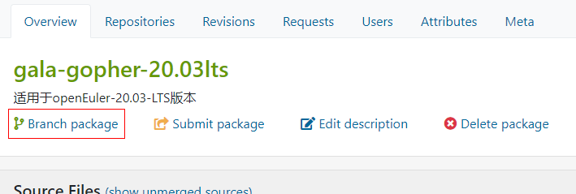
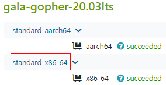
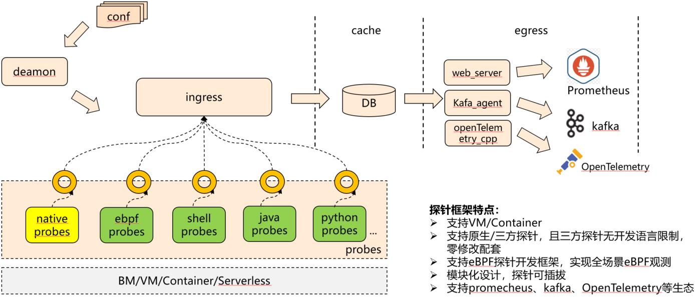
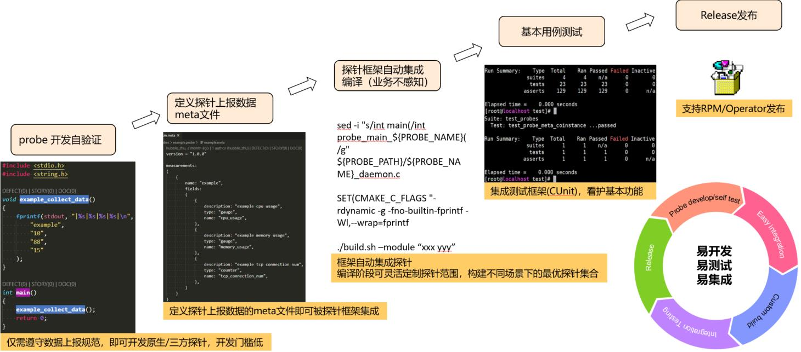

# gala-gopher

### 介绍
gala-gopher一款基于eBPF技术的探针框架，通过协同各种内核观测工具（包括CPU、网络、I/O、内存等）实现将操作系统运行状态白盒化呈现，并通过扩展能力提供系统性能瓶颈分析，应用性能劣化故障诊断等特性。

### 软件架构
gala-gopher集成了常用的native探针以及知名中间件探针；gala-gopher有良好的扩展性，能方便的集成各种类型的探针程序，发挥社区的力量丰富探针框架的能力；gala-gopher中的几个主要部件：

- gala-gopher框架

  gala-gopher的基础框架，负责配置文件解析、native探针/extend探针的管理、探针数据收集管理、探针数据上报对接、集成测试等；

- native探针

  原生探针，主要是基于linux的proc文件系统收集的系统观测指标；

- extend探针

  支持shell/java/python/c等不同语言的第三方探针程序，仅需满足轻量的数据上报格式即可集成到gala-gopher框架中；方便满足各种应用场景下的观测诉求；目前已实现知名中间件程序的探针观测及指标上报，如：lvs、nginx、haproxy、dnsmasq、dnsbind、kafka、rabbitmq等；

- 部署配置文件

  gala-gopher启动配置文件，可自定义具体使能的探针、指定数据上报的对接服务信息（kafka/prometheus等）

### 快速开始

#### 使用部署工具安装运行

- 获取部署工具
  1. 下载部署工具压缩包：wget https://gitee.com/Vchanger/a-ops-tools/repository/archive/master.zip --no-check-certificate (内网用户需要配置代理)
  2. 使用unzip解压压缩包后进入对应目录即可使用

- 执行工具脚本进行部署

  - rpm方式（仅支持openEuler 22.03 LTS/openEuler 22.03 LTS SP1)

    ```
    sh deploy.sh gopher -K <kafka服务器地址>
    ```

  - 容器镜像方式：

    ```
    sh deploy.sh gopher -K <kafka服务器地址> --docker --tag <容器镜像tag>
    ```

    注:目前支持的镜像版本tag有：euleros-v2r9（仅支持x86），20.03-lts，20.03-lts-sp1，22.03-lts，22.03-lts-sp1

  完成上述两步后gala-gopher即可进入运行状态。部署工具的使用约束说明与所有选项详细说明可参照[A-Ops-Tools部署工具手册](https://gitee.com/Vchanger/a-ops-tools#部署gala-gopher)

#### 基于rpm包安装运行

- 获取rpm包

  gala-gopher目前已在openEuler 21.09（已停止维护）/openEuler 22.09（已停止维护）/openEuler 22.03-LTS-SP1发布，可以通过配置以上发布版本的正式repo源来获取rpm包；对于其他发布版本我们提供了以下方式来获取rpm包：

  - OBS 链接：网页手动下载对应架构的rpm包

  ```basic
  openEuler-20.03-LTS : https://117.78.1.88/package/show/home:zpublic:branches:openEuler:20.03:LTS:SP1/gala-gopher-20.03lts
  openEuler-20.03-LTS-SP1 : https://117.78.1.88/package/show/home:zpublic:branches:openEuler:20.03:LTS:SP1/gala-gopher
  EulerOS-V2R9 : https://117.78.1.88/package/show/home:zpublic:branches:openEuler:20.03:LTS:SP1/gala-gopher-v2r9
  ```

  - 每日构建repo源：配置为yum源后安装

  ```basic
  openEuler 22.03-LTS: http://121.36.84.172/dailybuild/openEuler-22.03-LTS/openEuler-22.03-LTS/EPOL/main/
  ```

- rpm安装

  ```bash
  yum install gala-gopher
  ```

- 运行

  按照[配置文件介绍](./doc/conf_introduction.md)自定义修改配置文件后，执行如下命令在前台运行：

  ```bash
  gala-gopher
  ```

  或者通过 systemd 启动后台服务（推荐）：

  ```bash
  systemctl start gala-gopher.service
  ```

#### 基于容器镜像安装运行


- 获取容器镜像

  用户可以选择直接[获取官方容器镜像](#docker1)或自行[构建容器镜像](#docker2)

  <a id="docker1"></a>

  - 获取官方容器镜像

      在docker配置文件/etc/docker/daemon.json（文件不存在则需要新建）中追加如下内容来添加hub.oepkgs.net镜像仓库

      ```
      {
        "insecure-registries" : [ "hub.oepkgs.net" ]
      }
      ```

      完成后通过如下命令重启docker服务使配置生效：
      
      ```
      systemctl daemon-reload
      systemctl restart docker
      ```
      
      
      根据系统架构从对应仓库拉取指定版本的gala-gopher官方容器镜像（以openEuler 20.03 LTS SP1为例）：
      
      ```
      # x86
      docker pull hub.oepkgs.net/a-ops/gala-gopher-x86_64:20.03-lts-sp1
      
      # aarch64
      docker pull hub.oepkgs.net/a-ops/gala-gopher-aarch64:20.03-lts-sp1
      ```
      
      目前支持的镜像版本tag有：euleros-v2r9（仅支持x86），20.03-lts，20.03-lts-sp1，22.03-lts，22.03-lts-sp1

  <a id="docker2"></a>


  - 构建容器镜像

    获取gala-gopher的rpm包，获取方式详见第一小节[基于rpm包安装运行](#基于rpm包安装运行)。

    用于生成容器镜像的Dockerfile文件归档在[build目录](./build)，生成方法详见[如何生成gala-gopher容器镜像](doc/how_to_build_docker_image.md)。

- 创建并运行容器

  gala-gopher涉及两个配置文件：gala-gopher.conf和gala-gopher-app.conf。gala-gopher.conf主要用于配置探针的数据上报开关、探针参数、探针是否开启等；gala-gopher-app.conf是观测白名单，可以把用户感兴趣的进程名加入白名单，gala-gopher就会观测这个进程了。

  容器启动前需要用户自定义配置这两个配置文件，请在宿主机创建配置文件目录，并将[config目录](./config)下两个配置文件保存到该目录，示例如下：

  ```shell
  [root@localhost ~]# mkdir gopher_user_conf
  [root@localhost gopher_user_conf]# ll
  total 8.0K
  -rw-r--r--. 1 root root 3.2K Jun 28 09:43 gala-gopher.conf
  -rw-r--r--. 1 root root  108 Jun 27 21:45 gala-gopher-app.conf
  ```

  请按照[配置文件介绍](./doc/conf_introduction.md)自定义修改配置文件。在执行docker run命令时，需要将宿主机上自定义的配置文件目录和容器内/gala-gopher/user_conf目录映射，从而将自定义的配置信息同步到容器内。

  最后按照如下示例命令启动容器：

  ```shell
  docker run -d --name xxx -p 8888:8888 --privileged -v /etc/machine-id:/etc/machine-id -v /lib/modules:/lib/modules:ro -v /usr/src:/usr/src:ro -v /boot:/boot:ro -v /sys/kernel/debug:/sys/kernel/debug -v /sys/fs/bpf:/sys/fs/bpf -v /root/gopher_user_conf:/gala-gopher/user_conf/ -v /etc/localtime:/etc/localtime:ro -v /var/run/docker.sock:/var/run/docker.sock -v /var/lib/docker/overlay2:/var/lib/docker/overlay2 --pid=host gala-gopher:1.0.1
  ```

  成功启动容器后，通过docker ps可以看到正在运行的容器：

  ```shell
  [root@localhost build]# docker ps
  CONTAINER ID   IMAGE               COMMAND                  CREATED              STATUS              PORTS                    NAMES
  eaxxxxxxxx02   gala-gopher:1.0.1   "/bin/sh -c 'cp -f /…"   About a minute ago   Up About a minute   0.0.0.0:8888->8888/tcp   xxx
  ```

- 获取数据

  如上步骤docker run命令中所示，我们映射了宿主机8888端口和容器的8888端口，因而可以通过8888端口获取数据来验证gala-gopher是否运行成功：

  ```shell
  [root@localhost build]# curl http://localhost:8888
  ...
  gala_gopher_udp_que_rcv_drops{tgid="1234",s_addr="192.168.12.34",machine_id="xxxxx",hostname="eaxxxxxxxx02"} 0 1656383357000
  ...
  ```

  如上有指标数据输出则证明gala-gopher运行成功。

#### 基于源码编译、安装、运行

##### 仅编译二进制

​	建议在最低openEuler-20.03-LTS-SP1的环境执行编译动作，这是因为gala-gopher中ebpf探针编译依赖clang和llvm，大多数的bpf功能需要clang 10或者更高版本才可以正常工作，而20.03-SP1以下的发布版本中clang版本较低(低于10)。

如下编译安装脚本在[build目录](./build)。

- 安装依赖

  该步骤会检查安装架构感知框架所有的依赖包，涉及三方探针编译、运行的依赖包会在编译构建中检查安装。

  ```bash
  # sh build.sh --check
  ```

- 构建

  ```bash
  # sh build.sh --clean
  # sh build.sh --release     # RELEASE模式
  # 或者
  # sh build.sh --debug       # DEBUG模式
  ```

  注：在编译过程中出现如下信息，表示bpf探针编译需要的vmlinux.h文件缺失；

  

  ​	vmlinux.h文件包含了系统运行Linux内核源码中使用的所有类型定义，可以利用bpftool工具生成；我们已经预生成了几个openEuler发布版本的vmlinux.h文件在`src\probes\extends\ebpf.probe\src\include`目录，请根据内核版本、CPU架构选择相应的文件，并手动软链接到vmlinux.h；例如：

  ```shell
  [root@master ~]# uname -r
  4.19.90-2012.5.0.0054.oe1.x86_64
  [root@master ~]# ln -s linux_4.19.90-2012.5.0.0053.oe1.x86_64.h vmlinux.h
  ```

  生成vmlinux.h文件后再次执行编译命令。

- 安装

  ```bash
  # sh install.sh
  ```

- 运行

  ```bash
  # gala-gopher
  ```

##### 编译rpm包

​	我们提供了OBS地址，用于用户编译最新的rpm包。当用户需要最新的rpm包时，可以按照如下步骤自行编译出最新版本的rpm包。

- OBS路径如下：

```sh
EulerOS-V2R9C00 : https://117.78.1.88/package/show/home:zpublic:branches:openEuler:20.03:LTS:SP1/gala-gopher-v2r9
openEuler-20.03-LTS : https://117.78.1.88/package/show/home:zpublic:branches:openEuler:20.03:LTS:SP1/gala-gopher-20.03lts
openEuler-20.03-LTS-SP1 : https://117.78.1.88/package/show/home:zpublic:branches:openEuler:20.03:LTS:SP1/gala-gopher
openEuler-22.03-LTS : https://117.78.1.88/package/show/home:zpublic:branches:openEuler:22.03:LTS/gala-gopher
openEuler-22.09 : https://117.78.1.88/package/show/home:zpublic:branches:openEuler:22.09:Epol/gala-gopher
```

编译前需要选择对应版本的路径，并通过 `Branch package` 按钮拉出个人分支包，如下图所示：



> 注：branch操作仅需在第一次编包的时候执行一次，后续可以直接在 **个人已有项目** 处找到，直接执行后续的打包、上传编译等步骤。

- 源码打包

```shell
# 需要先将gala-gopher文件夹名重命名为gala-gopher-1.0.0
# 然后打成tar包
[root@master code]# tar zcvf gala-gopher-1.0.0.tar.gz gala-gopher-1.0.0/
```

- tar包上传并触发编译

  还是以编译能够在openEuler-20.03-LTS环境运行的rpm包为例，需要在**外网操作**。参考如下视频：


​	右侧 `Build Results` 框会显示编译结果，`building`表示还在编译中，`failed`表示编译失败，`succeeded`表示编译成功，编译成功则可以点击获取最新的rpm包。



- 安装

```shell
[root@master ~]# yum localinstall gala-gopher-1.0.0-2.oe1.x86_64.rpm
```

- 运行

```shell
# 前台运行
[root@master ~]# gala-gopher
# 通过systemd启动（推荐）
[root@master ~]# systemctl start gala-gopher.service
```

### 运行架构

技术特征

•**统一观测标准**：支持对接prometheus、kafka、openTelemetry标准。

•**低底噪**：提供eBPF观测技术，通过优化eBPF运行时性能、动态装卸载等技术降低观测底噪。

•**协同观测**：提供探针框架，根据场景协同各探针调整观测范围，避免观测碎片化。

•**对象式**：定义（且可扩展）系统观测实体以及实体间关系，实时构建出云服务数据流拓扑。



### 探针开发构建流程



### 详细介绍

#### 开发指南

[开发指南](doc/how_to_add_probe.md)

#### 配置文件介绍

[配置文件介绍](doc/conf_introduction.md)

#### eBPF探针开发指南

[eBPF探针开发指南](src/probes/extends/ebpf.probe/README.md)

#### 如何实现探针编译裁剪

[如何实现探针编译裁剪](doc/how_to_tail_probe.md)

#### API接口文档

[API介绍](doc/api_doc.md)

#### 测试框架介绍

[测试框架介绍](test/README.md)

#### 负载测试

#### 使用示例

[CDN视频直播环境部署运行架构感知](doc/example_CDN_trace.md)

基于CDN简化场景部署架构感知服务做了拓扑绘制的效果演示如下。


