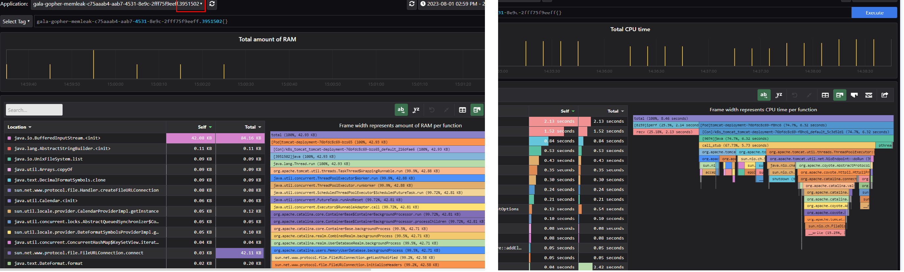
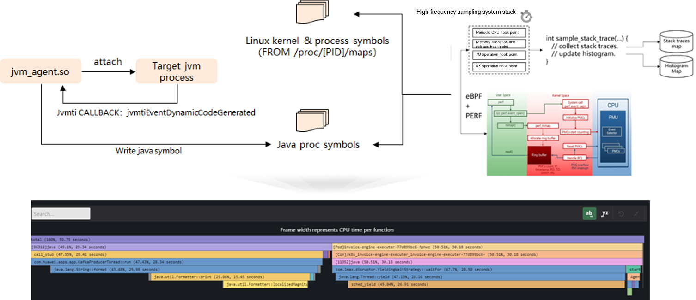

# gala-gopher


## Overview of gala-gopher

gala-gopher is a data collection component in the gala project. It provides data such as metrics, events, and Perf for the gala project to draw the system topology and locate root causes of faults.
gala-gopher is an observation platform that integrates non-intrusive technologies such as eBPF and Java agents. It uses probes as its primary tool for observing and collecting data. Thanks to its probe architecture, gala-gopher can easily add or remove probes as needed.

## Observation Scope

### System Performance

Resources at the system layer may affect application performance. gala-gopher provides system performance observation capabilities for nodes, containers, and devices, including the following metrics:

- CPU performance: For details, see [CPU performance metrics](https://gitee.com/openeuler/gala-docs/blob/master/gopher_tech.md#cpu). Real-time performance metrics at the CPU granularity are provided.
- Memory performance: For details, see [memory performance metrics](https://gitee.com/openeuler/gala-docs/blob/master/gopher_tech.md#%E5%86%85%E5%AD%98). Real-time metrics of multiple resources, such as system memory, buffer, cache, and dentry, are provided.
- Network performance: For details, see [NIC performance metrics](https://gitee.com/openeuler/gala-docs/blob/master/gopher_tech.md#%E7%BD%91%E5%8D%A1%E7%BB%9F%E8%AE%A1) and [protocol stack performance metrics](https://gitee.com/openeuler/gala-docs/blob/master/gopher_tech.md#%E5%8D%8F%E8%AE%AE%E6%A0%88%E7%BB%9F%E8%AE%A1). The metrics include the number of TCP connections on the host, number of received packets, number of bytes sent and received by the NIC, and number of lost packets.
- I/O performance: For details, see [block performance metrics](https://gitee.com/openeuler/gala-docs/blob/master/gopher_tech.md#block%E7%BB%9F%E8%AE%A1) and [disk metrics](https://gitee.com/openeuler/gala-docs/blob/master/gopher_tech.md#%E7%A3%81%E7%9B%98%E7%BB%9F%E8%AE%A1). The metrics include the disk read/write speed, usage, and throughput, as well as delay and error statistics of block-layer drivers and devices.
- Container performance: For details, see [container performance metrics](https://gitee.com/openeuler/gala-docs/blob/master/gopher_tech.md#%E5%AE%B9%E5%99%A8%E6%80%A7%E8%83%BD). Observable data from multiple dimensions such as CPU, memory, I/O, and network is provided for containers.

### Network Monitoring

With network monitoring, you can easily obtain the following information:

- TCP traffic topology between microservices in a cluster: Process-level [TCP traffic monitoring](https://gitee.com/openeuler/gala-docs/blob/master/gopher_tech.md#tcp%E6%8C%87%E6%A0%87) is provided. With [gala-spider](https://gitee.com/openeuler/gala-spider), you can easily obtain the TCP topology between microservices in a cluster.
- DNS access monitoring: provides the average delay, maximum delay, and error rate of DNS domain name access in processes. For details, see [DNS access monitoring](https://gitee.com/openeuler/gala-docs/blob/master/gopher_tech.md#dns%E6%8C%87%E6%A0%87).
- TCP/IP monitoring: provides [exception monitoring](https://gitee.com/openeuler/gala-docs/blob/master/gopher_tech.md#tcp%E6%8C%87%E6%A0%87) at the TCP connection granularity, including exception metrics such as retransmission, packet loss, TCP OOM, and RST sending and receiving. It also provides [socket exception monitoring](https://gitee.com/openeuler/gala-docs/blob/master/gopher_tech.md#tcp%E6%8C%87%E6%A0%87), including statistics such as listen queue overflow, SYN queue overflow, and number of link setup failures.

### Application (Microservice) Access Performance Monitoring

In cloud native scenarios, a large number of microservices are deployed. The fluctuation of access performance between microservices directly affects the overall service effect. gala-gopher can be used to easily provide the [access delay, throughput, error rate](https://gitee.com/openeuler/gala-docs/blob/master/gopher_tech.md#%E5%BA%94%E7%94%A8%E6%80%A7%E8%83%BD) of each microservice (or pod).

The supported access protocols between microservices include HTTP/1.*X*, PostgreSQL, Redis, #DNS, #HTTP/2, #Dubbo, #MySQL, and #Kafka (# indicates that support for the protocol is being planned).

Supported encryption scenarios: C/C++ (OpenSSL 1.1.0/1.1.1), Go (GoTLS), and Java (JSSE class library)

### Detailed Application Monitoring

Application performance is often affected by system resource performance. gala-gopher provides refined system performance observation capabilities (at the process granularity) for applications, involving network, I/O, memory, and scheduling.

- [TCP performance](https://gitee.com/openeuler/gala-docs/blob/master/gopher_tech.md#tcp%E6%8C%87%E6%A0%87): provides performance metrics such as the TCP window, RTT, SRTT, reordering, and ato.
- [Application system delay](https://gitee.com/openeuler/gala-docs/blob/master/gopher_tech.md#%E5%BA%94%E7%94%A8%E7%B3%BB%E7%BB%9F%E6%97%B6%E5%BB%B6): provides application system delay (including the delay caused by the application network stack and scheduling) and application network delay (including the delay caused by the network stack and network transmission).
- [I/O performance](https://gitee.com/openeuler/gala-docs/blob/master/gopher_tech.md#%E5%BA%94%E7%94%A8io): provides statistics on I/O operation bytes, FD resource usage, and file system (vfs/ext4/overlay/tmpfs) delay of each process, number of large and small I/O operations, BIO delay, and error statistics (for the virtualized QEMU process).
- [Memory](https://gitee.com/openeuler/gala-docs/blob/master/gopher_tech.md#%E5%BA%94%E7%94%A8%E5%86%85%E5%AD%98-1): provides statistics on page faults, swap partitions, dirty pages, virtual memory, and physical memory of each process.
- [JVM monitoring](https://gitee.com/openeuler/gala-docs/blob/master/gopher_tech.md#%E5%BA%94%E7%94%A8jvm): provides statistics on JVM threads, Java class loading, JVM memory, JVM buffer, and GC times/time.
- [DNS monitoring](https://gitee.com/openeuler/gala-docs/blob/master/gopher_tech.md#dns%E6%8C%87%E6%A0%87): obtains the DNS access performance of applications based on Glibc interfaces (such as gethostbyname and getaddrinfo).

### Performance Profiling

Flame graphs are commonly used to analyze performance. Common flame graph tools (perf and async-profiler) have disadvantages such as high overhead, insufficient refinement degree, and unsatisfying multi-language capability.

gala-gopher provides continuous, low-overhead, and multi-instance performance profiling capabilities, covering C/C++, Go, and Java. (To achieve the optimal effect, you are advised to add the **-XX:+PreserveFramePointe****r** startup parameter.)



For details, see [here](https://gitee.com/openeuler/gala-docs#qa).

### Kafka Monitoring

Kafka is a message broker commonly used for distributed applications. Existing monitoring tools cannot effectively observe and trace Kafka topics. To address this issue, gala-gopher provides automatic Kafka monitoring capabilities. The following capabilities are provided:

- [Topic flow monitoring](https://gitee.com/openeuler/gala-docs/blob/master/gopher_tech.md#topic%E6%B5%81%E7%9B%91%E6%8E%A7): provides the IP address and port information of the topic producer and consumer, and draws the topic flow view based on gala-spider.

- [Topic performance](https://gitee.com/openeuler/gala-docs/blob/master/gopher_tech.md#topic%E6%80%A7%E8%83%BD%E7%9B%91%E6%8E%A7): provides the throughput performance by topic.

  Constraints: Encryption scenarios are not supported.

### Nginx/HAProxy Monitoring

Nginx/HAProxy is usually used for load balancing between cloud native applications. After network traffic is balanced, existing monitoring tools cannot effectively observe the actual traffic paths between cloud native applications. To address this issue, gala-gopher provides the network traffic observation tailored to load balancing.

- [Nginx load balancing monitoring](https://gitee.com/openeuler/gala-docs/blob/master/gopher_tech.md#nginx-%E8%B4%9F%E8%BD%BD%E5%88%86%E6%8B%85%E7%9B%91%E6%8E%A7): provides the capability of observing Nginx load balancing sessions. Based on load balancing sessions, gala-spider can be used to draw the actual traffic paths between cloud native applications.
- [HAProxy load balancing monitoring](https://gitee.com/openeuler/gala-docs/blob/master/gopher_tech.md#haproxy%E8%B4%9F%E8%BD%BD%E5%88%86%E6%8B%85%E7%9B%91%E6%8E%A7): provides the capability of observing HAProxy load balancing sessions. Based on load balancing sessions, gala-spider can be used to draw the actual traffic paths between cloud native applications.


### High-Load Application Performance Monitoring

High-load applications include databases and caches, such as Redis and PostgreSQL. Existing performance monitoring tools (like dial tests and markers) introduce problems such as distortion and errors. gala-gopher provides delay SLI observation capabilities for Redis and PostgreSQL applications.

- [Redis performance monitoring](https://gitee.com/openeuler/gala-docs/blob/master/gopher_tech.md#redis%E6%80%A7%E8%83%BD%E7%9B%91%E6%8E%A7): provides refined (specific to a TCP connection) Redis delay monitoring capabilities. (Note that encryption scenarios are not supported.)
- [PostgreSQL performance monitoring](https://gitee.com/openeuler/gala-docs/blob/master/gopher_tech.md#postgresql%E6%80%A7%E8%83%BD%E7%9B%91%E6%8E%A7): provides refined (specific to a TCP connection) PostgreSQL delay monitoring capabilities.

Remarks: The difference between high-load application performance monitoring and [application access performance monitoring](./README.md#%E5%BA%94%E7%94%A8%E5%BE%AE%E6%9C%8D%E5%8A%A1%E8%AE%BF%E9%97%AE%E6%80%A7%E8%83%BD%E7%9B%91%E6%8E%A7) is that the former SLI includes the application processing delay and system processing delay, while the latter includes only the application processing delay.

## Software Architecture

gala-gopher integrates common native probes and well-known middleware probes. gala-gopher has good scalability and can easily integrate various types of probe programs, leveraging the power of the community to enrich the capabilities of the probe framework. The main components of gala-gopher are as follows:

- gala-gopher framework

  Basic framework of gala-gopher. It parses configuration files, manages native and extend probes, collects and manages probe data, reports and interconnects probe data, and performs integration tests.

- native probe

  Native probe. It is mainly used to collect system observation metrics based on the Linux proc file system.

- extend probe

  It supports third-party probe programs in different languages, such as Shell, Java, Python, and C. The probe programs can be integrated into the gala-gopher framework as long as they meet the lightweight data reporting format, meeting observation requirements in various application scenarios. Currently, the probe observation and metrics reporting of well-known middleware programs, such as LVS, Nginx, HAProxy, dnsmasq, BIND DNS, Kafka, and RabbitMQ, have been implemented.

- Deployment configuration file

  gala-gopher startup configuration file. It can be used to customize the basic framework behavior, such as the log level and the information about the interconnected service (such as Kafka and Prometheus) for specific data reporting.

## Installation Guide

### Quick Installation

- [RPM Mode](#RPM Mode) applies to single-node observation scenarios without containers. openEuler 22.03 LTS SP1 or later is supported.
- [Single-Node Container Mode](#Single-Node Container Mode) applies to single-node observation scenarios that support containerization. All openEuler LTS versions are supported. (openEuler 22.03 LTS SP1 or later is recommended.)
- [Kubernetes Cluster Mode](#Kubernetes Cluster Mode) applies to multi-node cloud-native cluster observation scenarios. All openEuler LTS versions are supported. (openEuler 22.03 LTS SP1 or later is recommended.)

#### RPM Mode

1. Obtain the RPM package.

   Select a proper version (the latest version is recommended) from the [release repository](https://gitee.com/openeuler/gala-gopher/releases) and download the RPM package of the corresponding architecture.

2. Install the RPM package.

   Configure the openEuler repository that matches the OS version. The repository must contain at least the **everything**, **update**, and **EPOL** directories. For details about the configuration method, see *Administrator Guide* in the openEuler community documentation. Then, run the following command to install the package (the 2.0.0-dev release and x86_64 architecture are used as an example):

   ```shell
   yum install gala-gopher-2.0.0-1.oe2203sp1.x86_64.rpm
   ```

3. Start the service.

   Start the backend service using systemd:

   ```shell
   systemctl start gala-gopher.service
   ```

#### Single-Node Container Mode

1. Obtain an official container image.

   ```shell
   # x86_64 architecture
   docker pull hub.oepkgs.net/a-ops/gala-gopher-x86_64

   # AArch64 architecture
   docker pull hub.oepkgs.net/a-ops/gala-gopher-aarch64
   ```

   *Note: If the error message "X509: certificate signed by unknown authority" is displayed during image pulling, add "hub.oepkgs.net" to the "insecure-registries" item in the **/etc/docker/daemon.json** file (if the file does not exist, manually create it), restart the Docker service, and try again.*

2. Prepare a BTF file.

   The cross-version compatibility (CO-RE) feature of gala-gopher depends on the kernel BTF file. In some early versions of openEuler, the kernel does not have a BTF file. In this case, you need to manually prepare a BTF file.

   You can check whether the **/sys/kernel/btf/vmlinux** file exists in the system. If yes, skip this step.

   Go to the directory of the corresponding OS version and architecture in the [openEuler BTF archive repository](https://gitee.com/openeuler/btfhub-archive), download the compressed BTF file that matches the kernel version (obtained by running the **uname -r** command), for example, **4.19.90-2012.4.0.0053.oe1.x86_64.btf.tar.xz**, and run the following command to decompress the file to the **/home** directory:

   ```shell
   tar -xf 4.19.90-2012.4.0.0053.oe1.x86_64.btf.tar.xz -C /home/
   ```

   *Note: For non-openEuler OSs, contact OSVs for support or create a BTF file by yourself.*

3. Create and run a container.

   The x86_64 architecture is used as an example. For the AArch64 architecture, you only need to replace the image name at the end.

   (1) If the **/sys/kernel/btf/vmlinux** file exists in the system:

   ```shell
   docker run -d --name gala-gopher --privileged --pid=host --network=host \
   -v /:/host -v /etc/localtime:/etc/localtime:ro -v /sys:/sys \
   -v /usr/lib/debug:/usr/lib/debug -v /var/lib/docker:/var/lib/docker \
   -e GOPHER_HOST_PATH=/host \
   hub.oepkgs.net/a-ops/gala-gopher-x86_64
   ```

   (2) If the **/sys/kernel/btf/vmlinux** file does not exist in the system, map the BTF file prepared in step 2 to the container.

   ```shell
   docker run -d --name gala-gopher --privileged --pid=host --network=host \
   -v /:/host -v /etc/localtime:/etc/localtime:ro -v /sys:/sys \
   -v /usr/lib/debug:/usr/lib/debug -v /var/lib/docker:/var/lib/docker \
   -v /home/4.19.90-2012.4.0.0053.oe1.x86_64.btf:/opt/gala-gopher/btf/4.19.90-2012.4.0.0053.oe1.x86_64.btf \
   -e GOPHER_HOST_PATH=/host \
   hub.oepkgs.net/a-ops/gala-gopher-x86_64
   ```

#### Kubernetes Cluster Mode

[Deployment Guide in the Kubernetes Environment](./k8s/README_EN.md)

#### Verifying the Installation

After the installation is complete, run the following command to verify the installation. If no error is reported, the installation is successful.

```shell
curl http://localhost:8888
```

### User-Defined Configuration

#### Configuring the Framework

The behavior of the framework during gala-gopher startup is controlled by the configuration file. For details, see [Configuration File Description](./doc/conf_introduction.md).

In container or Kubernetes scenarios, you can modify some configurations by setting the following parameters when deploying gala-gopher. (If no parameter is specified, the default configuration is used.)

| Variable Name                       | Variable Function                                                    | Configured Value                                                  |
| ----------------------------- | ------------------------------------------------------------ | ------------------------------------------------------------ |
| GOPHER_LOG_LEVEL              | Specifying the output level of gala-gopher logs                                 | The value can be **debug**, **info**, **warn**, or **error**.                         |
| GOPHER_EVENT_CHANNEL          | Output mode of gala-gopher subhealth inspection exception events                       | **kafka**: reported through Kafka (default); **logs**: output to local logs.           |
| GOPHER_META_CHANNEL           | Output mode of gala-gopher observed object metadata                   | **kafka**: reported through Kafka (default); **logs**: output to local logs.           |
| GOPHER_KAKFA_SERVER           | IP address of the Kafka server to which gala-gopher reports subhealth inspection exception events and observed object metadata| This variable can be left empty when both ***GOPHER_EVENT_CHANNEL*** and ***GOPHER_META_CHANNEL*** are set to **logs**. Otherwise, set this variable to a valid Kafka server IP address, for example, 1.2.3.4. (A port number can be specified in the IP address. If no port number is specified, the default port number 9092 is used.)|
| GOPHER_METRIC_ADDR            | Listening address of gala-gopher that functions as the Prometheus exporter to output metric data    | You are advised to set this variable to a valid NIC IP address of the local host. The default value is **0.0.0.0**, indicating that all IP addresses are listened to.         |
| GOPHER_METRIC_PORT            | Listening port of gala-gopher that functions as the Prometheus exporter to output metric data    | Set this variable to a valid port number that is not occupied by other programs. The default value is **8888**.              |
| GOPHER_REST_ADDR              | Dynamically configuring the listening address of the RESTful API                               | You are advised to set this variable to a valid NIC IP address of the local host. The default value is **0.0.0.0**, indicating that all IP addresses are listened to.         |
| GOPHER_REST_PORT              | Dynamically configuring the port number of the RESTful API                                   | Set this variable to a valid port number that is not occupied by other programs. The default value is **9999**.              |
| GOPHER_REST_AUTH              | Specifying dynamic configuration of whether to enable HTTPS and certificate authentication for the RESTful API            | **no**: disabled (default); **yes**: enabled                                |
| GOPHER_REST_PRIVATE_KEY       | Dynamically configuring the path of the private key file for enabling HTTPS for the RESTful API                  | This variable is mandatory when ***GOPHER_REST_AUTH*** is set to **yes**. The path must be an absolute path.                 |
| GOPHER_REST_CERT              | Dynamically configuring the path of the certificate file for enabling HTTPS for the RESTful API                  | This variable is mandatory when ***GOPHER_REST_AUTH*** is set to **yes**. The path must be an absolute path.                 |
| GOPHER_REST_CAFILE            | Dynamically configuring the path of the CA certificate file for enabling authentication for the RESTful API                 | This variable is mandatory when ***GOPHER_REST_AUTH*** is set to **yes**. The path must be an absolute path.                 |
| GOPHER_METRIC_LOGS_TOTAL_SIZE | Maximum total size of metrics data log files, in MB               | The value must be a positive integer. The default value is **100**.                                       |

#### Configuring and Starting Probes

By default, gala-gopher does not run any probes after startup. You need to use the RESTful API to start probes as required and configure their observation scope and running parameters.

For details, see [APIs for Dynamic Probe Configuration](./config/APIs for Dynamic Probe Configuration.md).

#### Configuring the Default Startup Probe

To eliminate the need for you to reconfigure and start the probe when restarting the gala-gopher service or container, gala-gopher provides a default probe configuration file for you to fix the probe configuration. This file is installed in **/etc/gala-gopher/probes.init**. The configuration format is **[Collection feature] [Configured JSON statement]**. Each probe occupies one line. A maximum of 20 lines can be configured. Excessive configurations will be ignored. For example:

```shell
tcp {"cmd":{"probe":["tcp_rtt","tcp_windows","tcp_abnormal"]},"snoopers":{"proc_name":[{"comm":"java","cmdline":""}]},"params":{"report_event":1},"state":"running"}
baseinfo {"cmd":{"probe":["cpu","fs","host"]},"state":"running"}
```

In container or Kubernetes scenarios, you can implement this function by setting the **GOPHER_PROBES_INIT** parameter when deploying gala-gopher. (If this parameter is not specified, no probe is run by default.) For example:

```shell
docker run -d --name gala-gopher --privileged --pid=host --network=host \
-v /:/host -v /etc/localtime:/etc/localtime:ro -v /sys:/sys \
-v /usr/lib/debug:/usr/lib/debug -v /var/lib/docker:/var/lib/docker \
-e GOPHER_HOST_PATH=/host \
-e GOPHER_PROBES_INIT='
baseinfo {"cmd":{"probe":["cpu","fs","host"]},"state":"running"}
tcp {"cmd":{"probe":["tcp_rtt"]},"snoopers":{"proc_name":[{"comm":"java"}]},"state":"running"}
' \
hub.oepkgs.net/a-ops/gala-gopher-x86_64
```

### Data Acquisition and Integration

[System integration APIs and methods](./doc/api_doc.md)

### Specifications and Constraints

[Specifications and constraints](./doc/constraints_introduction.md)

## How to Contribute

### Building from Source Code

#### **Compiling Only Binary Files**

**Build environment requirements**: openEuler 22.03 LTS SP1 or later, with the matching openEuler repository configured for the OS version. The repository must contain at least the **everything**, **update**, and **EPOL** directories. For details about the configuration method, see the *Administrator Guide* in the openEuler community documentation.

Download the repository source code to the local host, switch to the master branch, and run the following build commands in the [build directory](./build) of the source code:

1. Install build dependency packages.

   This step checks and installs all compilation dependency packages required by the architecture awareness framework. Dependency packages involved in third-party probe compilation and running will be checked and installed during compilation and building.

   ```shell
   # sh build.sh --check
   ```

2. Build.

   ```shell
   # sh build.sh --clean

   # sh build.sh --release     # release mode
   # Or
   # sh build.sh --debug       # debug mode
   ```

   Note: The debug mode and release mode have no functional differences. In debug mode, the framework and probes support debug printing, facilitating local debugging and fault locating.

3. Install.

   ```shell
   # sh install.sh
   ```

4. Run.

   ```shell
   # gala-gopher
   ```

#### Building the RPM Package

**Build environment requirements**: openEuler 22.03 LTS SP1 or later, with the matching openEuler repository configured for the OS version. The repository must contain at least the **everything**, **update**, and **EPOL** directories. For details about the configuration method, see the *Administrator Guide* in the openEuler community documentation.

Download the repository source code to the local host, switch to the master branch, obtain the [gala-gopher.spec](./gala-gopher.spec) file from the root directory of the source code, and run the following build commands:

1. Install rpm-build and build dependency packages (refer to the binary compilation).

   ```shell
   # yum install rpm-build
   # sh build.sh --check
   ```

2. Generate a compressed source package and save it to the **/root/rpmbuild/SOURCES** directory.

   ```shell
   # cp -rf gala-gopher gala-gopher-2.0.0
   # tar czf gala-gopher-2.0.0.tar.gz gala-gopher-2.0.0
   # mkdir -p /root/rpmbuild/SOURCES
   # mv gala-gopher-2.0.0.tar.gz  /root/rpmbuild/SOURCES
   ```

3. Build the RPM package.

   ```shell
   rpmbuild -ba gala-gopher.spec
   ```

After the building is complete, the RPM package is stored in the corresponding architecture directory under **/root/rpmbuild/RPMS/**. The following is an example:

    /root/rpmbuild/RPMS/x86_64/gala-gopher-2.0.0-1.x86_64.rpm

#### Building a Container Image

1. Obtain the following files and place them in the same directory:

   - gala-gopher RPM package: Download it from the [release repository](https://gitee.com/openeuler/gala-gopher/releases) or build it from source code.

   - Dockerfile: Download the corresponding architecture file from the [build directory](./build).
   - entrypoint.sh: Download it from the [build directory](./build).

2. Run the following command in the directory to build a container image (x86_64 is used as an example):

    ```shell
    # docker build -f Dockerfile_x86_64 -t gala-gopher:2.0.0 .
    ```

3. Save/Import a container image.

    After a container image is generated, you can run the **save** command to save the image as a `.tar` file.

    ```shell
    # docker save -o gala-gopher-2.0.0.tar gala-gopher:2.0.0
    ```

    You can run the **load** command on other host machines to import the container image.

    ```shell
    # docker load gala-gopher-2.0.0.tar
    ```

### Probe Development

[Probe Development Guide](./doc/how_to_add_probe.md)

## Q&A

### How Does eBPF Run Better in Java Scenarios?

#### Scenario 1: Continuous Performance Profiling

gala-gopher provides continuous performance profiling to monitor application performance metrics such as OnCPU, OffCPU, and Memory Alloc. The monitoring application uses the eBPF periodic or event-triggered mode to continuously collect application stack information.

The Java agent is used to obtain the Java function symbol table, and eBPF is used to obtain stack information. The two are combined to implement continuous profiling in Java scenarios.



#### Scenario 2: Microservice Access Performance Monitoring

The microservice access performance monitoring provided by gala-gopher can monitor L7 traffic performance in a non-intrusive and multi-language manner. In Java scenarios, Java applications use the JSSE class library for encrypted communication. eBPF obtains encrypted L7 traffic at the kernel layer, and cannot parse the traffic or monitor performance. The Java agent bytecode injection technology is used to attach **JSSEProbeAgent.jar** to the target JVM process to obtain plaintext RPC messages, which are then read into L7 through temporary files.

![Performance RPC ciphertext observation in Java scenarios] (./doc/pic/java-agent-2.png)

### How Do I Resolve Cross-Version Compatibility Issues?

For details, see [here](./doc/compatible.md).

## Roadmap

### Inspection Capabilities

| Feature                            | Release Time| Release Version                            |
| -------------------------------- | -------- | ------------------------------------ |
| TCP exception inspection                     | 2022-12   | openEuler 22.03 SP1                  |
| Socket exception inspection                  | 2022-12   | openEuler 22.03 SP1                  |
| System call exception inspection                | 2022-12   | openEuler 22.03 SP1                  |
| Process I/O exception inspection                 | 2022-12   | openEuler 22.03 SP1                  |
| Block I/O exception inspection               | 2022-12   | openEuler 22.03 SP1                  |
| Resource leakage exception inspection                | 2022-12   | openEuler 22.03 SP1                  |
| Hardware (disk/NIC/memory) fault inspection  | 2023-09   | openEuler 22.03 SP1, openEuler 23.09 |
| JVM exception inspection                     | 2023-09   | openEuler 22.03 SP1, openEuler 23.09 |
| Host network stack (including virtualization) packet loss inspection| 2023-09   | openEuler 22.03 SP1, openEuler 23.09 |

### Observability

| Feature                                                        | Release Time| Release Version                            |
| ------------------------------------------------------------ | -------- | ------------------------------------ |
| Process-level TCP observation capability                                           | 2022-12   | openEuler 22.03 SP1                  |
| Process-level socket observation capability                                        | 2022-12   | openEuler 22.03 SP1                  |
| SDS full-stack I/O observation capability                                   | 2022-12   | openEuler 22.03 SP1                  |
| Virtualized storage I/O observation capability                                       | 2022-12   | openEuler 22.03 SP1                  |
| Block I/O observation capability                                           | 2022-12   | openEuler 22.03 SP1                  |
| Container running observation capability                                            | 2022-12   | openEuler 22.03 SP1                  |
| Redis performance monitoring capability                                           | 2022-12   | openEuler 22.03 SP1                  |
| PostgreSQL performance observation capability                                              | 2022-12   | openEuler 22.03 SP1                  |
| Nginx session observation capability                                           | 2022-12   | openEuler 22.03 SP1                  |
| HAProxy session observation capability                                         | 2022-12   | openEuler 22.03 SP1                  |
| Kafka session observation capability                                           | 2022-12   | openEuler 22.03 SP1                  |
| JVM performance observation capability                                             | 2023-06   | openEuler 22.03 SP1, openEuler 23.09 |
| L7 protocol observation capability (HTTP/1.*X*/MySQL/PostgreSQL/Redis/Kafka)           | 2023-09   | openEuler 22.03 SP1, openEuler 23.09 |
| L7 protocol observation capability (HTTP/1.*X*/MySQL/PostgreSQL/Redis/Kafka/MongoDB/DNS/RocketMQ)| 2024-03   | openEuler 22.03 SP3, openEuler 24.03|
| General application performance observation capability                                        | 2024-03   | openEuler 24.03                      |
| Full-link protocol tracing capability                                          | 2024-09   | openEuler 24.09                      |

### Performance Profiling

| Feature                                   | Release Time| Release Version                            |
| --------------------------------------- | -------- | ------------------------------------ |
| System performance profiling (OnCPU and Mem)        | 2023-03   | openEuler 23.09                      |
| System performance profiling (OnCPU, Mem, and OffCPU)| 2023-04   | openEuler 22.03 SP1, openEuler 23.09 |
| Thread-level performance profiling (Java and C)         | 2023-06   | openEuler 22.03 SP1, openEuler 23.09 |

### Version Compatibility

| Feature                       | Release Time| Release Version                            |
| --------------------------- | -------- | ------------------------------------ |
| Compatibility with kernel releases with version gaps| 2023-12   | openEuler 22.03 SP3, openEuler 24.03 |
| Compatibility with kernel releases with large version gaps     | 2024-09   | openEuler 24.09                      |
|                             |          |                                      |

### Programmability and Scalability

| Feature                          | Release Time| Release Version           |
| ------------------------------ | -------- | ------------------- |
| Non-intrusive integration of third-party probes          | 2022-12   | openEuler 22.03 SP1 |
| Non-intrusive integration of third-party eBPF source code      | 2024-03   | openEuler 23.09     |
| Automatic generation of eBPF observation probes driven by LLMs| 2024-09   | openEuler 24.09     |

### Deployment and Integration Capabilities

| Feature                            | Release Time| Release Version                            |
| -------------------------------- | -------- | ------------------------------------ |
| Support for interconnection with Prometheus exporter     | 2022-12   | openEuler 22.03 SP1                  |
| Support for interconnection in log file format            | 2022-12   | openEuler 22.03 SP1                  |
| Support for interconnection in Kafka client mode        | 2022-12   | openEuler 22.03 SP1                  |
| Support for dynamic probe monitoring capability change through RESTful APIs| 2023-06   | openEuler 22.03 SP1, openEuler 23.09 |
