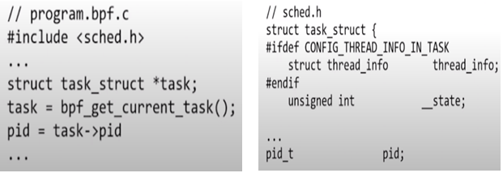
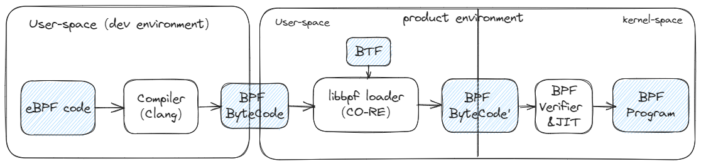
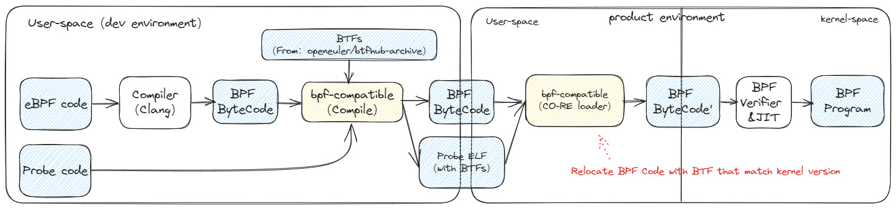

# 版本兼容性方案介绍

## 背景

在面临集群运维场景，集群内会存在多平台、多版本情况，为了便于简化部署、版本管理，gala-gopher通常需要兼容多个OS版本。要解决多个OS版本问题，要解决三个问题：

1. eBPF程序的内核版本兼容性
2. eBPF程序的用户态软件兼容性（比如openSSL）
3. 基础库/工具依赖兼容性（比如glibc）

## eBPF程序内核版本兼容性

内核观测时，eBPF Program存在访问内核数据行为，所以其存在与内核版本兼容配套的问题。如下图所示，eBPF Program会访问内核`struct task_struct`成员`pid`，如果不同内核版本配置项`CONFIG_THREAD_INFO_IN_TASK`开启/关闭，会导致`pid`成员偏移不同，产生兼容性问题。



Linux社区提供的解决方案是CO-RE技术（Compile Once Run Everywhere），但CO-RE技术只有在kernel >5.4版本才能使用，且依赖运行环境开启CONFIG_DEBUG_INFO_BTF。这些局限性会限制eBPF在内核观测的可实施性。


### 业界方案

方案1：BCC 源码交付件形式，在目标主机上编译eBPF代码，以确保兼容性。但是会依赖目标主机需要安装编译器（clang），`kernel header`头文件等，既占用空间成本，也占用时间成本。

方案2：libbpf + CO-RE方式，利用BTF（BPF类型格式）描述内核数据结构的内存布局信息，通过CO-RE能力，在加载eBPF program时，基于BTF信息进行内核访问偏移的重定位。原理图如下：



方案2又引入一个新的问题：BTF从何获取？BTF依赖内核开启`CONFIG_DEBUG_INFO_BTF=y`，但实际很多OS发行版都不会开启该配置项。为此，对应的解决方案是将OS发行版的BTF进行归档，参考[这里](https://github.com/aquasecurity/btfhub-archive)。该方案是目前主流方案，比如pixie（参考[这里](https://blog.px.dev/ebpf-portability/)），cool-bpf等；

### 项目方案

- 构建openEuler BTF管理基础设施，归档于：openeuler/btfhub-archive。
- openEuler引入bpf-compatible，在编译阶段，用户可以指定支持的内核版本范围，将BTFs插入probe ELF文件内；加载时，bpf-compatible根据生产环境实际版本信息选择相应的BTF，对BPF ByteCode进行reloacte。



bpf-compatible项目：https://github.com/eunomia-bpf/bpf-compatible

## eBPF程序用户态软件兼容性

用户态软件观测时的兼容性问题原因与内核态相似，也是因为eBPF Program需要访问用户态软件的内存信息，所以会导致与用户态软件版本强相关；

由于用户态软件没有类似内核BTF的描述信息，通常的解决方案是针对不同的用户态软件版本写不同的eBPF Code，Probe构建时携带多个eBPF Program，加载时根据实际软件版本情况加载相应的eBPF Program；

## 基础库/工具依赖兼容性

### GLIBC

GLIBC 2.34版本做了多个非兼容性工作，比如：将libpthread.so中的符号全部迁移到了libc.so中，用户在使用pthread相关库函数时，不再需要链接pthread。（低版本编译的程序，可以在高版本运行，因为2.34保留了一个空的libpthread.so.0）。

所以在高版本构建的gala-gopher无法在低版本运行，反之即可。

### libbpf等

libbpf等基础库也会影响gala-gopher及其探针的兼容性问题，基本原则是采取静态链接方式，降低运行态的依赖关系。

### bpftool

bpftool工具在构建过程中，用于生成BPF skeleton、裁剪BTF等工作，其版本需要与libbpf版本配套。

**问题：**由于历史问题，libbpf、bpftool两个项目从linux 内核社区分离出来作为[独立项目](https://github.com/libbpf)发展，造成这两个软件之间的配套关系有点复杂。

**现状（写本文之时）**:openEuler libbpf来源于[libbpf独立项目](https://github.com/libbpf/libbpf)，而bpftool依然是由kernel构建产生；导致这两个软件版本并不配套。比如，openEuler 22.03 SP1 libbpf版本是0.8.1，而其bpftool版本相比较[bpftool独立项目](https://github.com/libbpf/bpftool)相差2年多。

实际配套关系：

```
bpftool v6.7  <--> libbpf 0.7.0
bpftool v6.8  <--> libbpf 0.8
bpftool v7.0  <--> libbpf 1.0
bpftool v7.1  <--> libbpf 1.1
bpftool v7.2  <--> libbpf 1.2
```

**解决方案：**openEuler引入[bpftool独立项目](https://github.com/libbpf/bpftool)，使其与libbpf版本配套。