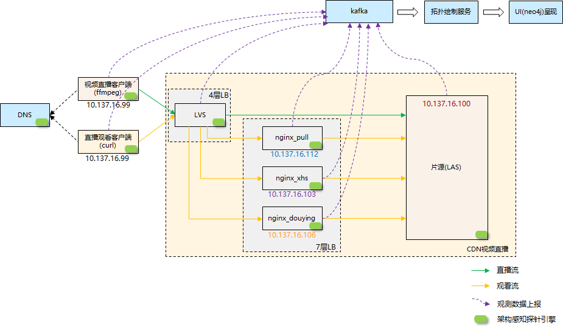
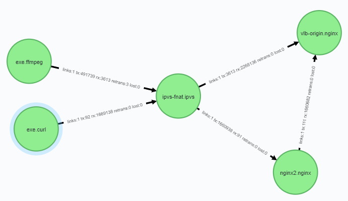
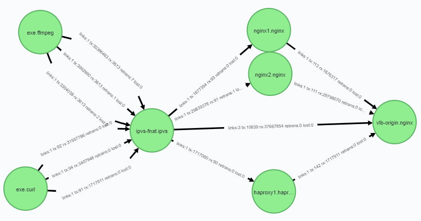
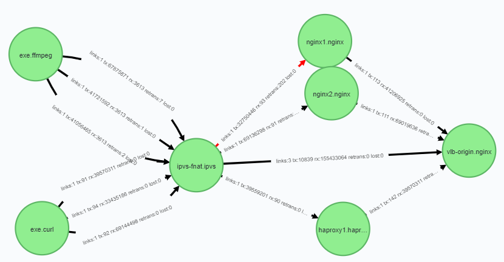

# 架构感知使用示例

## gala-gopher安装运行

- rpm安装

```
yum install gala-gopher-v1.1.0-2.x86_64.rpm
```

- 运行

```
systemctl start gala-gopher
```

## gala-spider安装运行

​	简单开发验证优选neo4j方案，本示例展示了“DB为kafka，UI为neo4j”方案的安装运行流程。请确认kafka节点能够访问集群的每个节点，保证gala-gopher生产的数据能产生到kafka中；请确认gala-spider的部署节点能访问kafka所在节点，保证gala-spider能成功消费数据。

安装neo4j软件

```
安装包可以从官网获取，也可以从如下地址获取；注意windows和linux的安装包不一样。
官网：https://neo4j.com/download-center/#community
其他：https://we-yun.com/doc/neo4j-chs/3.5.5/
安装参考：https://blog.csdn.net/hxg117/article/details/79929579         (Windows)
         https://blog.csdn.net/u013946356/article/details/81736232     (Linux)
```

安装kafka

```
提供docker搭建kafka的安装方法，仅供参考：
https://www.jianshu.com/p/cec64efdf1e0
```

获取gala-spider源码

```
https://gitee.com/openeuler/A-Ops/tree/master/gala-spider
```

修改配置文件

1. gala-spider在windows运行：

   ```
   global:
       data_source: "kafka"
       ui_source: "neo4j"
       observe_conf_path: D:\A-Ops\gala-spider\config\observe.yaml	---配置实际的异常检测路径
   
   kafka:
       topic: gala_gopher
       broker: ["xx.xx.xx.xx:9092"]					       ----配置环境中kafka的ip和端口
   
   neo4j:
       address: http://localhost:7474					       ----配置neo4j浏览器地址
       username: neo4j								          ----配置neo4j浏览器登录名
       password: xxxxxx							          ----配置neo4j浏览器登录密码
       timer: 5                                                 ----配置获取拓扑数据的周期(>=5)
       
   temp_path:									  ----从kafka消费的数据会存入如下临时文件
       temp_tcp_file: "D:\\A-Ops\\gala-spider\\tcpline.txt"     ----配置实际的tmp文件路径
       temp_other_file: "D:\\code\\gala-spider\\otherline.txt"
       
   ```

2. gala-spider在linux运行：

   ```
   global:
       data_source: "kafka"
       ui_source: "neo4j"
       observe_conf_path: /etc/spider/observe.yaml				---使用默认配置
   
   kafka:
       topic: gala_gopher
       broker: ["xx.xx.xx.xx:9092"]					       ----配置环境中kafka的ip和端口
   
   neo4j:
       address: http://localhost:7474					       ----配置neo4j浏览器地址
       username: neo4j								          ----配置neo4j浏览器登录名
       password: xxxxxx							          ----配置neo4j浏览器登录密码
       timer: 5                                                 ----配置获取拓扑数据的周期(>=5)
       
   temp_path:
       temp_tcp_file: "/var/tmp/spider/tcpline.txt"		    ----使用默认配置
       temp_other_file: "/var/tmp/spider/otherline.txt"
       temp_other_file: "D:\\code\\gala-spider\\otherline.txt"
   
   anomaly_detection:
       tcp_link:                                              -- 观测对象为tcp_link
           detection_model_type: EXPERT_MODEL                 -- 配置异常检测的模型为EXPERT_MODEL
           detection_attributes:
               retran_packets: {threshold: 50, method: ">"）  -- 配置观测属性retran_packets
   ```

安装依赖包

```
yum install python3-kafka-python -y
```

源码运行

```
python3 daemon.py
```

## CDN视频直播环境运行效果

- 简介

  

- 测试说明

  ```
  通过构造几种推拉流，在neo4j browser查看实时拓扑信息。
  ```

  推单条pull流：

  ```s
  ./ffmpeg -re -stream_loop -1 -i /home/record.flv -c copy -f flv "rtmp://pull.source.com/live/she"
  ```

  

  单条推拉pull流：

  ```s
  在推流的基础上执行curl拉流：
  curl -v http://pull.source.com/live/she.flv > flv.log
  ```

  

  三条推拉流：

  ```s
  ./ffmpeg -re -stream_loop -1 -i /home/record.flv -c copy -f flv "rtmp://douyin.source.com/live/she"
  curl -v http://douyin.source.com/live/she.flv > flv.log
  ./ffmpeg -re -stream_loop -1 -i /home/record.flv -c copy -f flv "rtmp://xhs.source.com/live/she"
  curl -v http://xhs.source.com/live/she.flv > flv.log
  ```

  

  构造异常测试：
  在nginx1节点模拟数据报重复：

  ```s
   tc qdisc add dev ens5 root netem duplicate 5%
  ```

  然后观察，相应的curl流速度变慢；拓扑图上看到，从ipvs-fnat到nginx1.nginx的链路为红色，从链路指标数据可以看出，指标total_retrans为77；
  