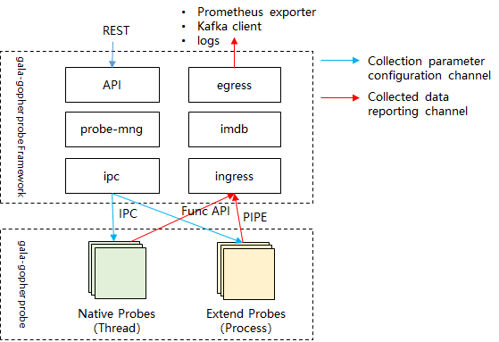

开发指南
============
## 逻辑视图

gala-gopher主要包括探针框架和探针程序两部分。



其中探针框架包括：

- daemon

  探针框架主程序，负责配置解析、探针管理、数据库对接以及整个数据上报流程的管理协同； 

- conf

  用户配置文件；

- ingress

  探针数据上报入方向处理模块，主要是获取各个探针上报的数据、以及数据存入imdb等处理；

- egress

  探针数据上报出方向处理模块，对接不同的数据库上报；

- imdb

  数据缓存处理模块；

- probes

  探针管理模块，负责native探针和三方探针的调度、监控等；


## 开发视图

gala-gopher开发目录结构如下：

```
gala-gopher
  ├── build/
  │   ├── build.sh              # 项目构建脚本
  │   ├── install.sh            # 项目安装脚本
  │   ├── Dockerfile_2003_sp1_aarch64 # Dockerfile文件
  │   └── Dockerfile_2003_sp1_x86_64  # Dockerfile文件
  ├── config/
  │   ├── gala-gopher.conf      # 项目配置文件
  │   └── task_whitelist.conf   # APP白名单配置文件
  ├── doc/                      # 项目开发和使用文档
  ├── service/                  # systemd启动配置
  │   └── gala-gopher.service
  ├── src/                      # 项目源码
  │   ├── cmd/                  # cmd模块
  │   ├── daemon/               # daemon模块
  │   ├── egress/               # egress模块
  │   ├── ingress/              # ingress模块
  │   ├── common/               # common公共模块
  │   ├── lib/                  # lib基础库
  │   │   ├── base.h
  │   │   ├── config/           # config模块
  │   │   ├── fifo/             # fifo模块
  │   │   ├── imdb/             # imdb模块
  │   │   ├── kafka/            # kafka模块
  │   │   ├── meta/             # meta模块
  │   │   └── probe/            # probe模块
  │   ├── probes/               # 探针开发源码
  │   │   ├── event.probe             # 系统异常事件探针
  │   │   ├── example.probe           # native探针示例
  │   │   ├── extends                 # 第三方探针源码
  │   │   └── system_infos.probe      # native探针
  │   ├── resource/             # resource模块
  │   └── web_server/           # webserver模块
  └── test/                     # 测试代码
  ├── test_modules/         # 模块测试代码
  ├── test_modules.sh       # 模块测试脚本
  ├── test_probes/          # 探针测试代码
  └── test_probes.sh        # 探针测试脚本
```


## 如何扩展数据采集范围

gala-gopher支持用户新增探针扩展监控范围，由[逻辑视图](#逻辑视图)可知探针分为native_probe和extends_probe，本章将首先介绍meta文件定义规范，然后介绍如何新增native探针和如何新增extends探针。

### meta文件定义规范

探针框架会按照各个探针meta文件定义的格式解析探针输出数据，各个探针需要严格按照meta文件定义的格式打印输出。

**meta文件配置项说明如下：**

- version：meta文件版本号
- measurements：探针数据表list，同一个list可以配置多张数据表
  - table_name：数据表名称
  - entity_name：观测对象名称
  - fields：数据字段
    - description：数据字段描述信息
    - type：数据字段类型，目前只支持key、label、gauge和counter
    - name：数据字段名称

**meta文件定义规范如下：**

- meta文件基本格式固定，归档位置为各个探针目录
- 每张数据表数据字段必须有key，label可选，至少有一个metric，metric即最终输出的指标名称

- 同一个观测对象可以配置多张数据表，约束如下：
  - 每张数据表要保证`entity_name`一致、`table_name`唯一
  - 每张数据表数据字段的key数量、名字必须一致
  - 多张数据表的label可以不一致

**示例文件：**

```conf
version = "1.0.0"

measurements:
(
    {
        table_name: "tcp_tx_rx",
        entity_name: "tcp_link",
        fields:
        (
            {
                description: "id of process",
                type: "key"
                name: "tgid",
            },
            {
                description: "comm of the process",
                type: "label",
                name: "comm",
            },
            {
                description: "rx bytes",
                type: "counter",
                name: "rx_bytes",
            },
        )
    },
    {
        table_name: "tcp_rtt",
        entity_name: "tcp_link",
        fields:
        (
            {
                description: "id of process",
                type: "key",
                name: "tgid",
            },
            {
                description: "Smoothed Round Trip Time(us).",
                type: "gauge",
                name: "srtt",
            },
        )
    }
)
```

> 说明：示例meta文件中配置了两张数据表：`tcp_tx_rx`和`tcp_rtt`，两张数据表的观测对象名`entity_name`一致，均为`tcp_link`。数据字段中`key`一致，均为`tgid`；`tcp_tx_rx`数据表有`label`而`tcp_rtt`数据表没有label字段。

#### 

### 如何新增native探针

#### 探针参考

```basic
example.probe
```

#### 1. 定义探针的main函数

探针main函数要以`int main()`形式，不支持使用`int main(int argc, char *argv[])`作为main函数。

以example.c作参考:

```c
int main()
{
    example_collect_data();
    return 0;
}
```
#### 2. 定义探针的meta文件

```conf
version = "1.0.0"

measurements:
(
    {
        table_name: "example",
        entity_name: "example",
        (
            {
                description: "example keyword",
                type: "key",
                name: "key_name",
            },
            {
                description: "example cpu usage",
                type: "gauge",
                name: "cpu_usage",
            },
        )
    }

```

#### 3. 输出探针指标

探针采集的数据需调用`nprobe_fprintf`打印输出；

打印输出的每个数据字段按照 `|` 分割；

打印输出中第一个字段是数据表名称`<table_name>`；

第二个及后面的每个数据字段**必须**和meta文件定义的数据字段一一对应；

打印输出时，key类型的数据字段**不可为空**，label、counter和gauge类型的数据字段可以为空，框架会过滤且不上报值为空的标签和指标。

如下为探针example的输出示例：

```c
void example_collect_data()
{
    nprobe_fprintf(stdout, "|%s|%s|%s|%s|%s|\n",
        "example",  // table_name
        "system",   // 对应meta文件中数据字段key_name(key字段，输出值不可为空)
        "high",	    // 对应meta文件中数据字段cpu_usage
        "low",      // 对应meta文件中数据字段memory_usage
        "15"        // 对应meta文件中数据字段tcp_connection_num
    );
}
```

按照上面的方式开发好探针后，就可以被框架自动集成了。


### 如何新增extends探针

#### 探针参考

```basic
cadvisor.probe
```

#### 1. 定义探针目录

三方探针请按照语言目录归档，同一种语言的探针归档到同一目录下。以python语言的三方探针为例，其源码所在目录为`src/probes/extends/python.probe`。

```shell
python.probe
├── install.sh                    -- 按需定义build.sh/install.sh
├── cadvisor.probe                -- 集成cadvisor探针的目录
│   ├── cadvisor_probe.meta       -- 探针meta文件
│   └── cadvisor_probe.py         -- 探针程序
└── redis.probe                   -- redis探针目录
    ├── redis_probe.meta		 -- 探针meta文件
    └── redis_probe.py			 -- 探针程序
```

#### 2. 定义meta文件

meta文件定义规范详见[meta文件定义规范](#meta文件定义规范)。

#### 3. 输出探针指标

输出格式要求同[输出探针指标](#3.-输出探针指标)，有区别的是，三方探针采集的数据需要调用`fprintf`打印输出。

> 注：为满足该条要求，探针程序可能需要做少量适配；

#### 4 定义build.sh

如果探针涉及编译，需要定义build.sh（编译脚本名称必须为`build.sh`，探针框架编译时会强匹配脚本名称），如果不需要可以不定义（如shell探针）；build.sh负责该类型探针的编译过程。

#### 5 定义install.sh

install.sh用于安装编译出的探针程序。

install.sh参数如下：

| 参数     | 含义         | 必选 | 使用场景                                                     |
| -------- | ------------ | ---- | ------------------------------------------------------------ |
| 安装路径 | 指定安装路径 | N    | gala-gopher集成编译时会指定，install.sh中需处理该参数，将程序安装到指定目录下，否则按install.sh默认安装路径安装； |

#### 6 支持探针编译裁剪

参考[如何实现探针编译裁剪](how_to_tail_probe.md)

### 其他

对于eBPF探针，考虑到方便探针程序开发，集成了一个轻量的eBPF开发框架，详细了解请点击[进入](../src/probes/extends/ebpf.probe/README.md)。

