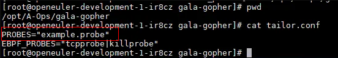

如何实现探针编译裁剪
============

## 介绍

gala-gopher作为探针框架，默认集成了各种native/extends探针程序，同时支持各种三方探针的扩展；但不同解决方案场景下，可能仅需要其中的部分探针，gala-gopher提供了探针粒度的编译裁剪机制，支持native/extends探针的编译裁剪，实现不同解决方案场景下“量身定做”的探针引擎；

## 探针编译裁剪方案思路

探针框架支持原生探针和三方探针，三方探针的构建程序一般是自带的，裁剪规则可能也各不相同；裁剪方案思路：

1. 统一裁剪入口，如定义一个统一的tail.conf文件，承载不同探针的裁剪信息（裁剪文件中的裁剪信息格式为各个探针按照自己的需要定义，将来也是自己解析）；
2. 编译框架解析裁剪文件，将其中的配置信息转换成环境量继承到各个探针编译/安装的shell脚本中；
3. 不同探针提供的buil.sh中，获取与自己相关的裁剪环境量，实现编译安装的裁剪；

## 探针编译裁剪方法

探针框架支持原生探针和三方探针，三方探针的构建程序一般是自带的，裁剪规则可能也各不相同；考虑通过环境量方式统一裁剪策略的输入形式；

- tail.conf

  在A-Ops/gala-gopher目录下，放置tailor.conf裁剪文件，探针框架构建时，会先将tailor.conf内容export成环境变量，各探针构建程序按需获取跟自己相关的环境变量做裁剪定制； 

以裁剪native探针的`example.probe `为例：

- 定义tail.conf

  

  tail.conf中的每一行定义了一个裁剪的配置项（一般每种探针类型分别定义自己的配置项名称），如：

  `PROBES="example.probe"`

  其中`PROBES`是配置项名称，`"example.probe"`是配置项值，当存在多个探针裁剪时，不同裁剪探针信息放在一起作为配置项的值设置，裁剪信息之间的分隔符可自行定义，如`|`；

- native探针build.sh脚本适配

  build.sh中可以引用到名为`PROBES`的环境量值

  ```sh
  function prepare_probes()
  {
      if [ ${PROBES} ]; then
          # check tailor env
          PROBES_PATH_LIST=$(echo "$PROBES_PATH_LIST" | grep -Ev "$PROBES")
          echo "prepare probes after tailor: " ${PROBES_PATH_LIST}
      fi
  
      cd ${PROBES_FOLDER}
      for PROBE_PATH in ${PROBES_PATH_LIST}
      do
  @@ -90,6 +113,7 @@ function compile_extend_probes()
      done
  }
  ```

  不同探针程序的适配逻辑各不相同。