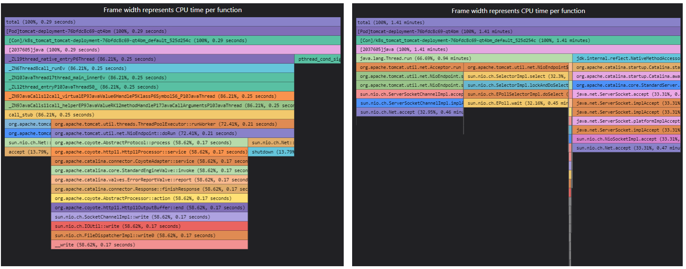
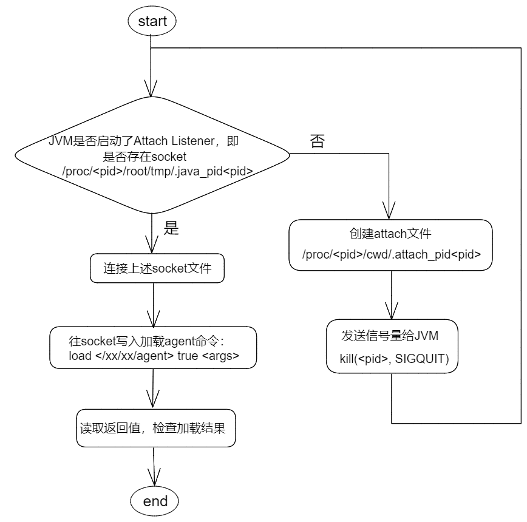

# stackprobe简介


## 探针描述

适用于云原生环境的性能火焰图。


## 特性

- 支持观测C/C++、Go、Rust、Java语言、Python语言应用。

- 调用栈支持容器、进程粒度：对于容器内进程，在调用栈底部分别以[Pod]和[Con]前缀标记工作负载Pod名称、容器Container名称。进程名以[<pid>]前缀标识，线程及函数（方法）无前缀。

- 支持本地生成svg格式火焰图或上传调用栈数据到中间件。

- 支持依照进程粒度多实例生成/上传火焰图。

- 对于Java进程的火焰图，支持同时显示本地方法和Java方法。

- 支持oncpu/offcpu/mem等多类型火焰图。

- 支持自定义采样周期。


## 使用说明

启动命令示例（基本）：使用默认参数启动性能火焰图。

```shell
curl -X PUT http://localhost:9999/flamegraph -d json='{ "cmd": {"probe": ["oncpu"] }, "snoopers": {"proc_name": [{ "comm": "cadvisor"}] }, "state": "running"}'
```

启动命令示例（进阶）：使用自定义参数启动性能火焰图。完整可配置参数列表参见[探针运行参数](https://gitee.com/openeuler/gala-gopher/blob/master/config/gala-gopher%E6%94%AF%E6%8C%81%E5%8A%A8%E6%80%81%E9%85%8D%E7%BD%AE%E6%8E%A5%E5%8F%A3%E8%AE%BE%E8%AE%A1_v0.3.md#%E6%8E%A2%E9%92%88%E8%BF%90%E8%A1%8C%E5%8F%82%E6%95%B0)。

```shell
curl -X PUT http://localhost:9999/flamegraph -d json='{ "cmd": {"probe": ["oncpu", "offcpu", "mem"] }, "snoopers": {  "proc_name": [{   "comm": "cadvisor",   "cmdline": "",   "debugging_dir": ""  }, {   "comm": "java",   "cmdline": "",   "debugging_dir": ""  }] }, "params": {  "perf_sample_period": 100,  "svg_period": 300,  "svg_dir": "/var/log/gala-gopher/stacktrace",  "flame_dir": "/var/log/gala-gopher/flamegraph",  "pyroscope_server": "localhost:4040",  "multi_instance": 1,  "native_stack": 0 }, "state": "running"}'
```

下面说明主要配置项：

- 设置开启的火焰图类型

  通过probe参数设置，参数值为`oncpu`，`offcpu`，`mem`，`mem_glibc`，分别代表进程cpu占用时间，进程被阻塞时间，进程申请内存大小的统计，进程申请内存大小的统计(观测glibc函数)。
  其中`mem`基于tracepoint实现，底噪低，便于长期持续性观测，但是对于少量（缓慢）内存泄漏不敏感；`mem_glibc`基于uprobe实现，准确性高，可以检测到所有内存申请动作，但是底噪较高，不适宜长期开启。如果要查看内存火焰图，正常情况下`mem`和`mem_glibc`选择其一即可。
  
  示例：

  ` "probe": ["oncpu", "offcpu", "mem", "mem_glibc"]`

- 设置生成本地火焰图svg文件的周期

  通过svg_period参数设置，单位为秒，默认值180，可选设置范围为[30, 600]的整数。
  
  示例：

  `"svg_period": 300`

- 开启/关闭堆栈信息上传到pyroscope

  通过pyroscope_server参数设置，参数值需要包含addr和port，参数为空或格式错误则探针不会尝试上传堆栈信息。

  上传周期30s。
  
  示例：

  `"pyroscope_server": "localhost:4040"`

- 设置调用栈采样周期

  通过perf_sample_period设置，单位为毫秒，默认值10，可选设置范围为[10, 1000]的整数，此参数仅对oncpu类型的火焰图有效。
  
  示例：

  `"perf_sample_period": 100`
  
- 开启/关闭多实例生成火焰图
  
  通过multi_instance设置，参数值为0或1，默认值为0。值为0表示所有进程的火焰图会合并在一起，值为1表示分开生成每个进程的火焰图。
  
  示例：
  
  `"multi_instance": 1`
  
- 开启/关闭本地调用栈采集
  
  通过native_stack设置，参数值为0或1，默认值为0。此参数仅对JAVA进程有效。值为0表示不采集JVM自身的调用栈，值为1表示采集JVM自身的调用栈。
  
  示例：
  
  `"native_stack": 1`
  
  显示效果：（左"native_stack": 1，右"native_stack": 0）
  
  
  


## 实现方案

### 1. 用户态程序逻辑

周期性地（30s）根据符号表将内核态上报的堆栈信息从地址转换为符号。然后使用flamegraph插件或pyroscope将符号化的调用栈转换为火焰图。

其中，对于代码段类型获取符号表的方法不同。

- 内核符号表获取：读取/proc/kallsyms。

- 本地语言符号表获取：查询进程的虚拟内存映射文件（/proc/{pid}/maps），获取进程内存中各个代码段的地址映射，然后利用libelf库加载每个代码段对应模块的符号表。

- Java语言符号表获取：

  由于 Java 方法没有静态映射到进程的虚拟地址空间，因此我们采用其他方式获取符号化的Java调用栈。

  #### 方式一：perf观测

  通过往Java进程加载JVM agent动态库来跟踪JVM的方法编译加载事件，获取并记录内存地址到Java符号的映射，从而实时生成Java进程的符号表。这种方法需要Java进程开启-XX:+PreserveFramePointer启动参数。本方式的优点是火焰图中可显示JVM自身的调用栈，而且这种方式生成的Java火焰图可以和其他进程的火焰图合并显示。

  #### 方式二：JFR观测
  
  通过动态开启JVM内置分析器JFR来跟踪Java应用程序的各种事件和指标。开启JFR的方式为往Java进程加载Java agent，Java agent中会调用JFR API。本方式的优点是对Java方法调用栈的采集会更加准确详尽。
  
  上述两种针对Java进程的性能分析方法都可以实时加载（不需要重启Java进程）且具有低底噪的优点。当stackprobe的启动参数为"multi_instance": 1且"native_stack": 0时，stackprobe会使用方法二生成Java进程火焰图，否则会使用方法一。

### 2. 内核态程序逻辑

内核态基于eBPF实现。不同火焰图类型对应不同的eBPF程序。eBPF程序会周期性地或通过事件触发的方式遍历当前用户态和内核态的调用栈，并上报用户态。

#### 2.1 oncpu火焰图：

在perf SW事件PERF_COUNT_SW_CPU_CLOCK上挂载采样eBPF程序，周期性采样调用栈。

#### 2.2 offcpu火焰图：

在进程调度的tracepoint(sched_switch)上挂载采样eBPF程序，采样eBPF程序中记录进程被调度出去时间和进程id，在进程被调度回来时采样调用栈。

#### 2.3 mem火焰图：

在缺页异常的tracepoint(page_fault_user)上挂载采样eBPF程序，事件触发时采样调用栈。

### 3. Java语言支持：

- stackprobe主进程：

  1. 接收到ipc消息获取要观测的Java进程。
  2. 使用Java代理加载模块向待观测的Java进程加载JVM代理程序：jvm_agent.so（对应[方式一](####方式一：perf观测)）或JstackProbeAgent.jar（对应[方式二](####方式二：JFR观测)）。
  3. 方式一主进程会加载对应java进程的java-symbols.bin文件，供地址转换符号时查询。方式二主进程会加载对应java进程的stacks-{flame_type}.txt文件，可直接供火焰图生成。

- Java代理加载模块

  1. 发现新增java进程则将JVM代理程序复制到该进程空间下/proc/\<pid\>/root/tmp（因为attach时容器内JVM需要可见此代理程序）

  2. 设置上述目录和JVM代理程序的owner和被观测java进程一致
  3.  启动jvm_attach子进程，并传入被观测java进程相关参数

- JVM代理程序

  - jvm_agent.so：注册JVMTI回调函数

    当JVM加载一个Java方法或者动态编译一个本地方法时JVM会调用回调函数，回调函数会将java类名和方法名以及对应的内存地址写入到被观测java进程空间下（/proc/\<pid\>/root/tmp/java-data-\<pid\>/java-symbols.bin）

  - JstackProbeAgent.jar：调用JFR API

    开启持续30s的JFR功能，并转换JFR统计结果为火焰图可用的堆栈格式，结果输出到到被观测java进程空间下（/proc/\<pid\>/root/tmp/java-data-\<pid\>/stacks-\<flame_type\>.txt）。详见[JstackProbe简介](../../../java.probe/jstack.probe/readme.md#JstackProbe简介)。

- jvm_attach：用于实时加载JVM代理程序到被观测进程的JVM上
  （参考jdk源码中sun.tools.attach.LinuxVirtualMachine和jattach工具）

  1. 设置自身的namespace（JVM加载agent时要求加载进程和被观测进程的namespace一致）

  2. 检查JVM attach listener是否启动（是否存在UNIX socket文件：/proc/\<pid\>/root/tmp/.java_pid\<pid\>）

  3. 未启动则创建/proc/\<pid\>/cwd/.attach_pid\<pid\>，并发送SIGQUIT信号给JVM

  4. 连接UNIX socket

  5. 读取响应为0表示attach成功

  attach agent流程图示：

  

### 4. python 语言支持

对于 python 语言，oncpu 火焰图支持显示 python 应用程序的调用栈。

#### 约束说明

- 安装环境上需要安装对应 python 版本的 debuginfo 包，以获取python应用程序的调用栈信息。
- 当前支持的python版本包括：python3.9 。

#### python 调用栈获取

python 调用栈获取逻辑如下：

1. 用户侧：对于运行中的 python 进程，获取全局变量 `_PyRuntime` 的虚拟地址，用于后续读取 python 进程的栈帧信息。

   全局变量 `_PyRuntime` 保存了 python 解释器（cpython）的运行状态信息，包括：GIL锁信息、当前运行的线程状态信息等。当前运行的线程状态信息中，保存了 python 应用程序的栈帧信息，可从中获取到 python 应用程序的调用栈。

   全局变量 `_PyRuntime` 的虚拟地址的获取步骤为：

   1. 获取进程的地址映射文件 `/proc/<pid>/maps`，读取 libpython so 的地址偏移和文件路径。
   2. 根据 libpython so 的文件路径，读取相应的 debug 文件名，并在 `/usr/lib/debug` 目录下获取 debug 文件的路径。
   3. 从 libpython so 的 debug 文件中读取全局变量 `_PyRuntime` 的虚拟地址。

2. 用户侧：获取 cpython 栈帧、符号等结构的偏移信息，用于后续读取 python 进程调用栈的类名、函数名等信息。

   cpython 相关结构体的偏移信息直接从 cpython 官方源码中提取，并硬编码到探针源码中。由于不同 cpython 版本中的结构体定义有差异，因此需要根据不同版本设置相应的偏移信息，当前支持的 python 版本为 python3.9，对应的结构体偏移信息保存在 `pystack/py39_offsets.c` 文件中。

3. 用户侧：将每个运行中的 python 进程的 `_PyRuntime` 地址、偏移信息保存到一个 bpf map 中，用于 ebpf 程序侧读取。

4. ebpf 程序侧：获取当前 python 进程的配置信息，读取当前运行的线程状态地址，读取调用栈信息，并通过 perf event 事件发送到用户侧。

5. 用户侧：接收 perf event 事件，读取 python 进程的调用栈，生成火焰图。


## 注意事项

- 对于Java应用的观测，为获取最佳观测效果，请设置stackprobe启动选项为"multi_instance": 1, "native_stack": 0来使能JFR观测（JDK8u262+）。否则stackprobe会以perf方式来生成Java火焰图。perf方式下，请开启JVM选项XX:+PreserveFramePointer（JDK8以上）。
- 对于python语言，安装环境上需要安装对应 python 版本的 debuginfo 包，以获取python应用程序的调用栈信息。


## 约束条件

- 支持基于hotspot JVM的Java应用观测
- 当前支持的python版本包括：python3.9 。
