## 什么是 tprofiling ？

Profiling 是 gala-gopher 提供的一个主机侧的进程/线程级应用性能诊断工具，它使用 ebpf 技术观测进程/线程运行过程中的关键系统性能事件，并关联丰富的事件内容，从而实时地记录应用程序的运行状态和关键行为。
通过在前端界面以时间线的方式对 Profiling 结果进行展示，用户可以更加直观地分析这些线程在某段时间内正在做什么，比如是在 CPU 上执行还是阻塞在某个文件、网络操作上，从而帮助用户快速识别出一些应用性能问题。

## 功能特性

从操作系统的视角来看，一个运行的应用程序是由多个进程组成，每个进程是由多个运行的线程组成。tprofiling 通过观测这些线程运行过程中执行的一些关键行为（后面称之为**事件**）并记录下来，然后在前端界面以时间线的方式进行展示，进而就可以很直观地分析这些线程在某段时间内正在做什么，是在 CPU 上执行还是阻塞在某个文件、网络操作上。当应用程序出现性能问题时，通过分析对应线程的关键性能事件的执行序列，快速地进行定界定位。

基于当前已实现的事件观测范围， tprofiling 能够定位的应用性能问题场景主要包括：

- 文件 I/O 耗时、阻塞问题
- 网络 I/O 耗时、阻塞问题
- 锁竞争问题
- 死锁问题

随着更多类型的事件不断地补充和完善，tprofiling 将能够覆盖更多类型的应用性能问题场景。

### 事件观测范围

tprofiling 当前支持的系统性能事件包括两大类：系统调用事件和 oncpu 事件。

**系统调用事件**

应用性能问题通常是由于系统资源出现瓶颈导致，比如 CPU 资源占用过高、I/O 资源等待。应用程序往往通过系统调用访问这些系统资源，因此可以对关键的系统调用事件进行观测来识别耗时、阻塞的资源访问操作。

tprofiling 当前已观测的系统调用事件参见章节： [支持的系统调用事件](###支持的系统调用事件) ，大致分为几个类型：文件操作（file）、网络操作（net）、锁操作（lock）和调度操作（sched）。下面列出部分已观测的系统调用事件：

- 文件操作（file）
  - read/write：读写磁盘文件或网络，可能会耗时、阻塞。
  - sync/fsync：对文件进行同步刷盘操作，完成前线程会阻塞。
- 网络操作（net）
  - send/recv：读写网络，可能会耗时、阻塞。
- 锁操作（lock）
  - futex：用户态锁实现相关的系统调用，触发 futex 往往意味出现锁竞争，线程可能进入阻塞状态。
- 调度操作（sched）：这里泛指那些可能会引起线程状态变化的系统调用事件，如线程让出 cpu 、睡眠、或等待其他线程等。
  - nanosleep：线程进入睡眠状态。
  - epoll_wait：等待 I/O 事件到达，事件到达之前线程会阻塞。

**oncpu 事件**

此外，根据线程是否在 CPU 上运行可以将线程的运行状态分为两种：oncpu 和 offcpu ，前者表示线程正在 cpu 上运行，后者表示线程不在 cpu 上运行。通过观测线程的 oncpu 事件，可以识别线程是否正在执行耗时的 cpu 操作。

### 事件内容

线程 profiling 事件主要包括以下几部分内容。

- 事件来源信息：包括事件所属的线程ID、线程名、进程ID、进程名、容器ID、容器名、主机ID、主机名等信息。

  - `thread.pid`：事件所属的线程ID
  - `thread.comm`：事件所属的线程名
  - `thread.tgid`：事件所属的进程ID
  - `proc.name`：事件所属的进程名
  - `container.id`：事件所属的容器ID
  - `container.name`：事件所属的容器名
  - `host.id`：事件所属的主机ID
  - `host.name`：事件所属的主机名
  - `host.ip`：事件所属的主机IP

- 事件属性信息：包括公共的事件属性和扩展的事件属性。

  - 公共的事件属性：包括事件名、事件类型、事件开始时间、事件结束时间、事件执行时间等。

    - `event.name`：事件名
    - `event.type`：事件类型，目前支持 oncpu、file、net、lock、sched 五种。
    - `start_time`：事件开始时间，聚合事件中第一个事件的开始时间，关于聚合事件的说明参见章节：[聚合事件](###聚合事件) 。
    - `end_time`：事件结束时间，值为 （start_time + duration）。
    - `duration`：事件累计的执行时间，单位为毫秒。
    - `count`：事件聚合数量

  - 扩展的事件属性：针对不同的系统调用事件，补充更加丰富的事件内容。如 read/write 文件或网络时，提供文件路径、网络连接以及函数调用栈等信息。

    - `func.stack`：事件的函数调用栈信息
    
    - `io.top`：列表类型，存储前 3 个执行时间最长的文件、网络类等 I/O 事件的信息。
    
      列表中每项为一个字典类型，不同类型的 I/O 事件包含不同的属性值。共分为以下3类：
    
      - 文件类事件，包括属性：
        - `file.path`：文件路径
        - `file.inode`：可选，文件路径对应的 inode 号。当 `file.path` 无法成功获取时展示该值。
        - `duration`：该事件的执行时间，单位为毫秒
      - 网络类事件，包括属性：
        - `sock.conn`：tcp连接
        - `file.inode`：可选，tcp连接对应的 inode 号。当 `sock.conn` 无法成功获取时展示该值。
        - `duration`：该事件的执行时间，单位为毫秒
      - 其它类事件，包括属性：
        - `file.inode`：inode 号。
        - `duration`：该事件的执行时间，单位为毫秒
    
    - `futex.top`：列表类型，存储前 3 个执行时间最长的 futex 系统调用事件 。
    
      列表中每项为一个字典类型，包括属性：
    
      - `op`：futex系统调用事件的操作类型，取值为 wait 或 wake 。
      - `duration`：该事件的执行时间，单位为毫秒
    
    不同事件类型支持的扩展事件属性的详细情况参见章节：[支持的系统调用事件](###支持的系统调用事件) 。

### 事件输出


## 快速开始

### 运行环境要求

1. 支持的内核版本：>= 4.18
2. 支持的操作系统：openEuler/EulerOS
3. 对python程序的支持：
   - 支持的python版本：3.7/3.8/3.9
   - 支持采集python语言的调用栈：内核版本需 > 4.19

### 安装部署

tprofiling 是 gala-gopher 提供的一个扩展的 ebpf 探针程序，因此，需要先安装部署好 gala-gopher 软件，然后再开启 tprofiling 功能。

#### 部署 tprofiling 探针

gala-gopher正常运行后，按照如下步骤使用 Profiling 功能。

##### <a id="start_profiling_task">1. 启动 Profiling 监控任务</a>

启动命令如下：

```bash
curl -X PUT http://localhost:9999/tprofiling -d json='{"cmd":{"probe": ["oncpu",  "oncpu_sample", "python_gc", "syscall_lock", "syscall_file", "syscall_net", "syscall_sched"]}, "snoopers":{"proc_name": [{"comm":"python3", "cmdline":""}]}, "state": "running"}'
```

启动配置参数说明：

- `"probe"` ：指定了 Profiling 事件的监控范围。
  当前支持如下6类事件，用户可根据需要开启一个或多个事件类型。
  
  - oncpu：线程是否在占用cpu的事件
  - oncpu_sample：线程在占用cpu期间的调用栈采样事件
  - syscall_file：线程在执行文件操作相关的系统调用事件，比如 read/write/sync
  - syscall_net：线程在执行网络操作相关的系统调用事件，比如 send/recv
  - sycall_lock：线程在执行锁相关的系统调用事件，比如 futex
  - syscall_sched：线程在执行调度相关的系统调用事件，比如 sleep/epoll_wait
  - python_gc：python线程执行的gc事件
  - pthread_sync：线程在执行 glibc 库中 pthread 相关的同步、锁事件，比如 pthread_mutex_lock/sem_wait
- `"snoopers"`：指定了要监控的应用程序范围。
  根据应用的部署方式，我们支持通过Pod ID（`pod_id`）、容器ID（`container_id`）、进程ID（`proc_id`）、进程名（`proc_name`）的方式来指定待监控的应用程序。`snoopers` 相关的配置示例如下，
  
  ```json
  json='
   {
       "snoopers": {
           "proc_id": [1255, 1256],
           "proc_name": [{"comm": "python3", "cmdline": ""}],
           "pod_id": ["pod-id-1", "pod-id-2"],
           "container_id": ["ba2bf847778c", "a4f3fba20924"]
       }
   }'
  ```
  
  其中，对于 `proc_name` 配置方式，可以通过 `comm` 匹配完整的进程名，同时可进一步通过 `cmdline` 来模糊匹配程序启动的命令行关键字，以便缩小要监控的应用范围。

##### 2. 关闭 Profiling 监控任务

关闭命令如下：

```bash
curl -X PUT http://localhost:9999/tprofiling -d json='{"state": "stopped"}'
```

##### <a id="query_profiling_output">3. 查看 Profiling 输出文件</a>

关闭 Profiling 监控任务后，会生成一个 json 格式的 Profiling 输出文件。该文件可以直接导入到 chrome 浏览器提供的 trace viewer UI 界面（在浏览器上输入 `chrome://tracing/` ）上展示 Profiling 的效果。

Profiling 输出文件存放在 gala-gopher 容器内部的 `/var/log/gala-gopher/tprofiling` 下，可通过如下命令查看，

```bash
docker exec <your_container_id> ls /var/log/gala-gopher/tprofiling
```

输出文件的名称会带上一个时间戳（启动 Profiling 监控任务的时间），例如 `timeline-trace-202404261508.json` 。

接下来，可通过 `docker cp` 命令把相应的 Profiling 输出文件拷出来。例如，

```bash
docker cp <your_container_id>:/var/log/gala-gopher/tprofiling/timeline-trace-202404261508.json ./
```

#### 效果展示

下载下面的文件到本地，打开google chrome浏览器，输入 `chrome://tracing/` 打开Profiling界面，通过 Load 按钮加载下载的本地文件，即可以看到 Profiling 分析结果。

[timeline-trace-202406121458-good-example.json](/vision-file-storage/api/file/download/attachment-v2/2024/5/13/415868d7671a46618401bc50aa6f5681/20240613T194616Z_181a4f88ed934334bb21923f7f3b7284.json?attachment_id=8799856)

Profiling展示效果如下：

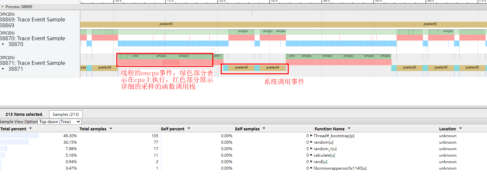


## 使用案例

### 案例1：死锁问题定位

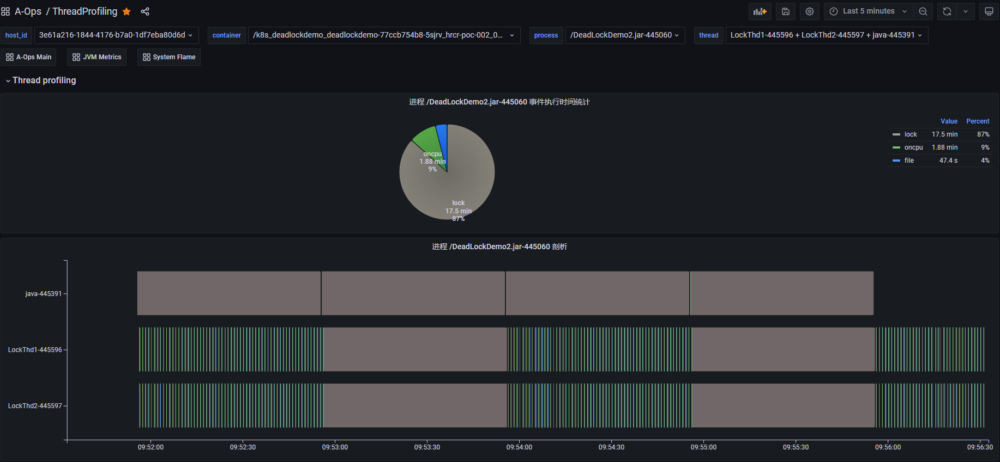

上图是一个死锁 Demo 进程的线程 profiling 运行结果，从饼图中进程事件执行时间的统计结果可以看到，这段时间内 lock 类型事件（灰色部分）占比比较高。下半部分是整个进程的线程 profiling 展示结果，纵轴展示了进程内不同线程的 profiling 事件的执行序列。其中，线程 `java` 为主线程一直处于阻塞状态，业务线程 `LockThd1` 和 `LockThd2` 在执行一些 oncpu 事件和 file 类事件后会间歇性的同时执行一段长时间的 lock 类事件。将光标悬浮到 lock 类型事件上可以查看事件内容，（如下图所示）它触发了 futex 系统调用事件，执行时间为 60 秒。

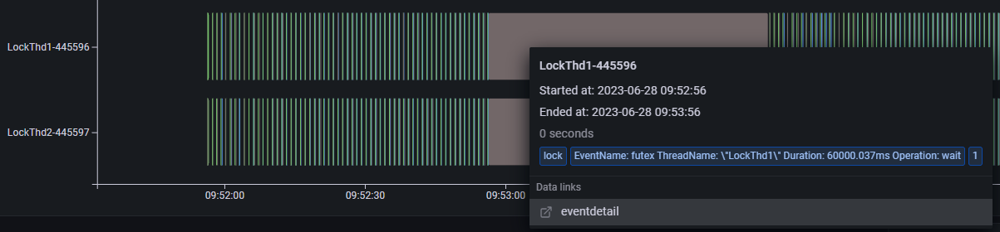

基于上述观测，我们可以发现业务线程 `LockThd1` 和 `LockThd2` 可能存在异常行为。接下来，我们可以进入线程视图，查看这两个业务线程 `LockThd1` 和 `LockThd2` 的线程 profiling 结果。

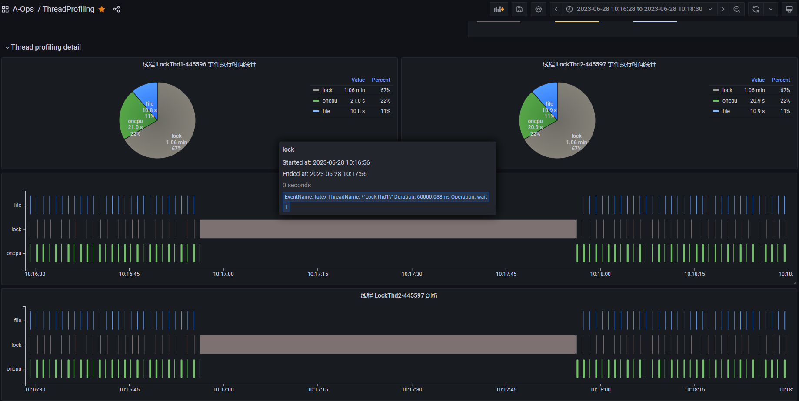

上图是每个线程的 profiling 结果展示，纵轴展示线程内不同事件类型的执行序列。从图中可以看到，线程 `LockThd1` 和 `LockThd2` 正常情况下会定期执行 oncpu 事件，其中包括执行一些 file 类事件和 lock 类事件。但是在某个时间点（10:17:00附近）它们会同时执行一个长时间的 lock 类型的 futex 事件，而且这段时间内都没有 oncpu 事件发生，说明它们都进入了阻塞状态。futex 是用户态锁实现相关的系统调用，触发 futex 往往意味出现锁竞争，线程可能进入阻塞状态。

基于上述分析，线程 `LockThd1` 和 `LockThd2` 很可能是出现了死锁问题。

### 案例2：锁竞争问题定位

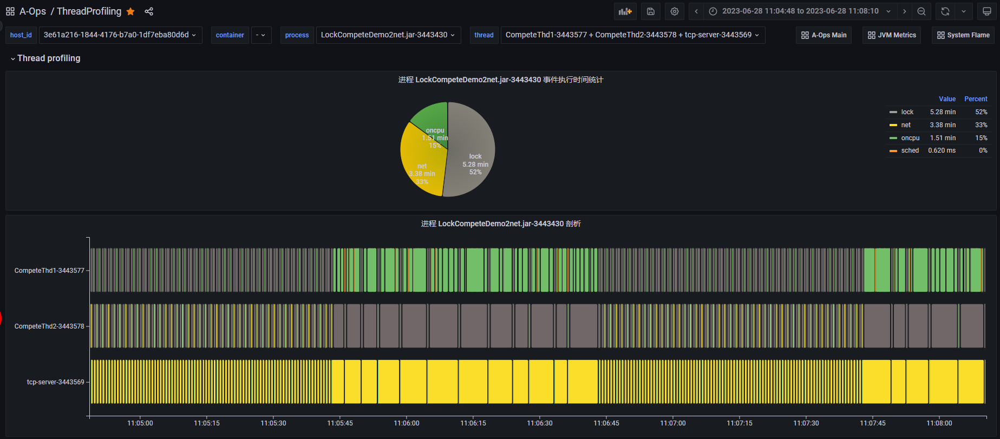

上图是一个锁竞争 Demo 进程的线程 profiling 运行结果。从图中可以看到，该进程在这段时间内主要执行了 lock、net、oncpu 三类事件，该进程包括 3 个运行的业务线程。在11:05:45 - 11:06:45 这段时间内，我们发现这 3 个业务线程的事件执行时间都变得很长了，这里面可能存在性能问题。同样，我们进入线程视图，查看每个线程的线程 profiling 结果，同时我们将时间范围缩小到可能有异常的时间点附近。

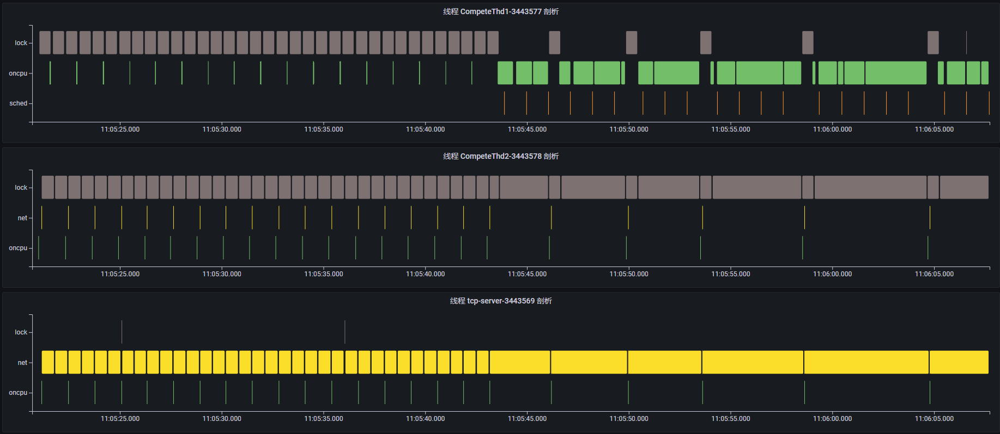

通过查看每个线程的事件执行序列，可以大致了解每个线程这段时间在执行什么功能。

- 线程 CompeteThd1：每隔一段时间触发短时的 oncpu 事件，执行一次计算任务；但是在 11:05:45 时间点附近开始触发长时的 oncpu 事件，说明正在执行耗时的计算任务。

  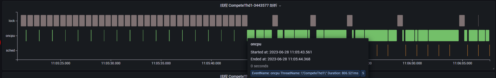

- 线程 CompeteThd2：每隔一段时间触发短时的 net 类事件，点击事件内容可以看到，该线程正在通过 write 系统调用发送网络消息，且可以看到对应的 tcp 连接信息；同样在 11:05:45 时间点附近开始执行长时的 futex 事件并进入阻塞状态，此时 write 网络事件的执行间隔变长了。

  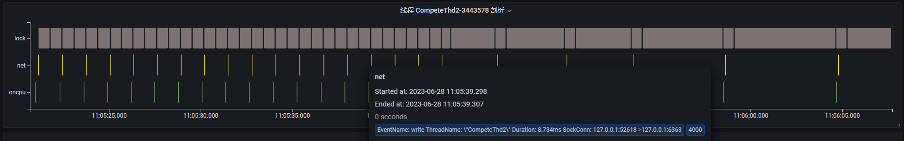

  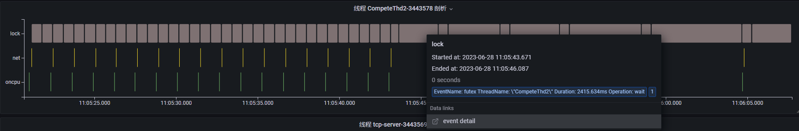

- 线程 tcp-server：tcp 服务器，不断通过 read 系统调用读取客户端发送的请求；同样在 11:05:45 时间点附近开始，read 事件执行时间变长，说明此时正在等待接收网络请求。

  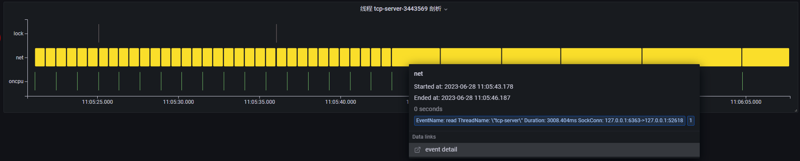

基于上述分析，我们可以发现，每当线程 CompeteThd1 在执行耗时较长的 oncpu 操作时，线程 CompeteThd2 都会调用 futex 系统调用进入阻塞状态，一旦线程 CompeteThd1 完成 oncpu 操作时，线程 CompeteThd2 将获取 cpu 并执行网络 write 操作。因此，大概率是因为线程 CompeteThd1 和线程 CompeteThd2 之间存在锁竞争的问题。而线程 tcp-server 与线程 CompeteThd2 之间存在 tcp 网络通信，由于线程 CompeteThd2 等待锁资源无法发送网络请求，从而导致线程 tcp-server 大部分时间都在等待 read 网络请求。

## 如何贡献

## topics

### Profiling能力地图&规划

Profiling 能力全景图&故障场景如下所示：

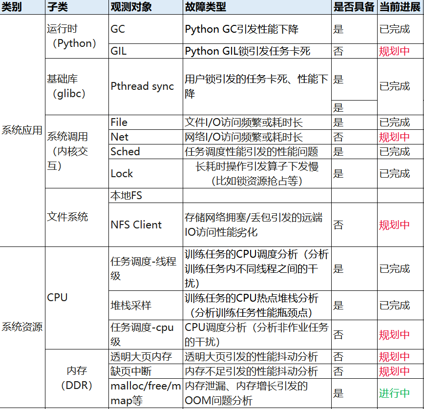


### 支持的系统调用事件

选择需要加入观测的系统调用事件的基本原则为：

1. 选择可能会比较耗时、阻塞的事件（如文件操作、网络操作、锁操作等），这类事件通常涉及对系统资源的访问。
2. 选择影响线程运行状态的事件。

| 事件名/系统调用名 | 描述                                                  | 默认的事件类型 | 扩展的事件内容                   |
| ----------------- | ----------------------------------------------------- | -------------- | -------------------------------- |
| read              | 读写磁盘文件或网络，线程可能会耗时、阻塞              | file           | file.path, sock.conn, func.stack |
| write             | 读写磁盘文件或网络，线程可能会耗时、阻塞              | file           | file.path, sock.conn, func.stack |
| readv             | 读写磁盘文件或网络，线程可能会耗时、阻塞              | file           | file.path, sock.conn, func.stack |
| writev            | 读写磁盘文件或网络，线程可能会耗时、阻塞              | file           | file.path, sock.conn, func.stack |
| preadv            | 读写磁盘文件或网络，线程可能会耗时、阻塞              | file           | file.path, sock.conn, func.stack |
| pwritev           | 读写磁盘文件或网络，线程可能会耗时、阻塞              | file           | file.path, sock.conn, func.stack |
| sync              | 对文件进行同步刷盘操作，完成前线程会阻塞              | file           | func.stack                       |
| fsync             | 对文件进行同步刷盘操作，完成前线程会阻塞              | file           | file.path, sock.conn, func.stack |
| fdatasync         | 对文件进行同步刷盘操作，完成前线程会阻塞              | file           | file.path, sock.conn, func.stack |
| sched_yield       | 线程主动让出 CPU 重新进行调度                         | sched          | func.stack                       |
| nanosleep         | 线程进入睡眠状态                                      | sched          | func.stack                       |
| clock_nanosleep   | 线程进入睡眠状态                                      | sched          | func.stack                       |
| wait4             | 线程阻塞                                              | sched          | func.stack                       |
| waitpid           | 线程阻塞                                              | sched          | func.stack                       |
| select            | 无事件到达时线程会阻塞等待                            | sched          | func.stack                       |
| pselect6          | 无事件到达时线程会阻塞等待                            | sched          | func.stack                       |
| poll              | 无事件到达时线程会阻塞等待                            | sched          | func.stack                       |
| ppoll             | 无事件到达时线程会阻塞等待                            | sched          | func.stack                       |
| epoll_wait        | 无事件到达时线程会阻塞等待                            | sched          | func.stack                       |
| sendto            | 读写网络时，线程可能会耗时、阻塞                      | net            | sock.conn, func.stack            |
| recvfrom          | 读写网络时，线程可能会耗时、阻塞                      | net            | sock.conn, func.stack            |
| sendmsg           | 读写网络时，线程可能会耗时、阻塞                      | net            | sock.conn, func.stack            |
| recvmsg           | 读写网络时，线程可能会耗时、阻塞                      | net            | sock.conn, func.stack            |
| sendmmsg          | 读写网络时，线程可能会耗时、阻塞                      | net            | sock.conn, func.stack            |
| recvmmsg          | 读写网络时，线程可能会耗时、阻塞                      | net            | sock.conn, func.stack            |
| futex             | 触发 futex 往往意味着出现锁等待，线程可能进入阻塞状态 | lock           | futex.op, func.stack             |

### 聚合事件

tprofiling 当前支持的系统性能事件包括两大类：系统调用事件和 oncpu 事件。其中，oncpu 事件以及部分系统调用事件（比如read/write）在特定的应用场景下可能会频繁触发，从而产生大量的系统事件，这会对观测的应用程序性能以及 tprofiling 探针本身的性能造成较大的影响。

为了优化性能，tprofiling 将一段时间内（例如10s）属于同一个线程的具有相同事件名的多个系统事件聚合为一个事件进行上报。因此，一个 tprofiling 事件实际上指的是一个聚合事件，它包含一个或多个相同的系统事件。相比于一个真实的系统事件，一个聚合事件的部分属性的含义有如下变化，

- `start_time`：事件开始时间，在聚合事件中是指第一个系统事件的开始时间
- `end_time`：事件结束时间，在聚合事件中是指（`start_time + duration`）
- `duration`：事件执行时间，在聚合事件中是指所有系统事件实际执行时间的累加值。
- `count`：聚合事件中系统事件的数量，当值为 1 时，聚合事件就等价于一个系统事件。
- 扩展的事件属性：在聚合事件中是指排名前3执行时间最长的系统事件的扩展属性
